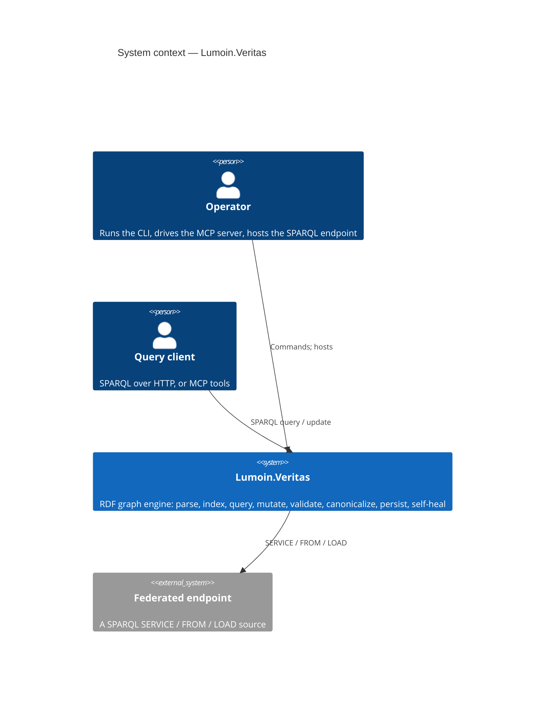
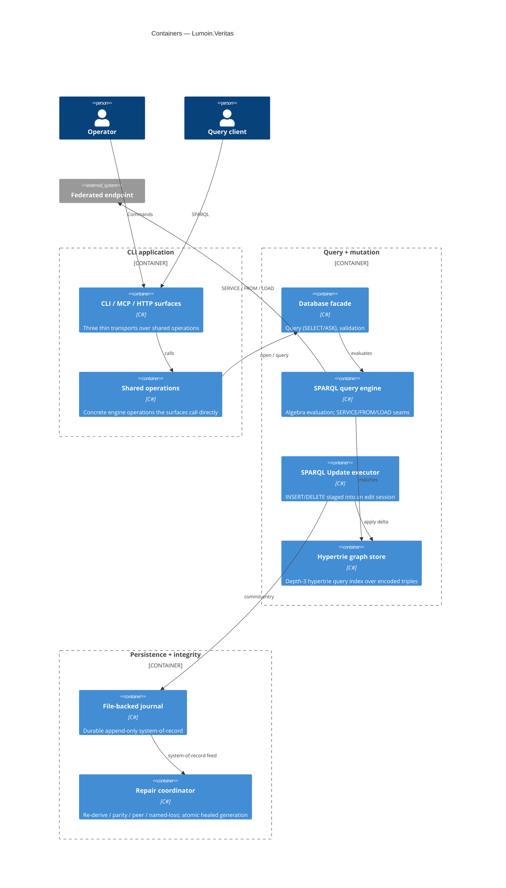
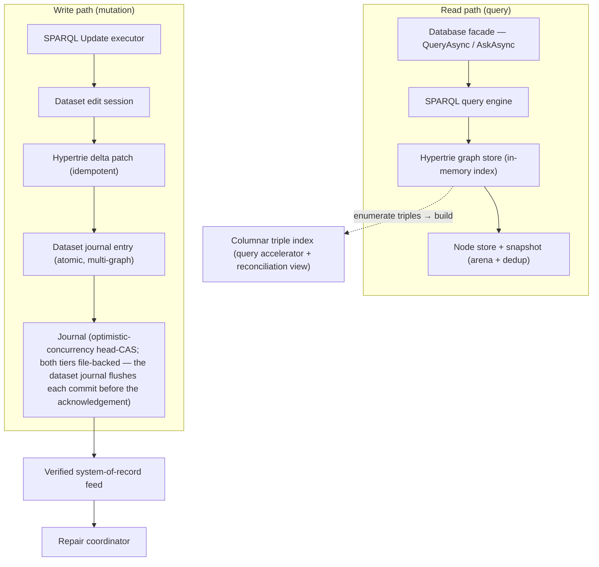
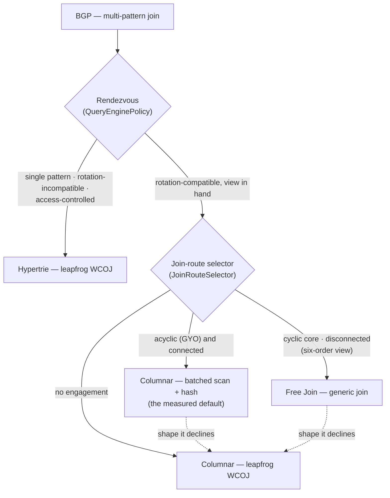
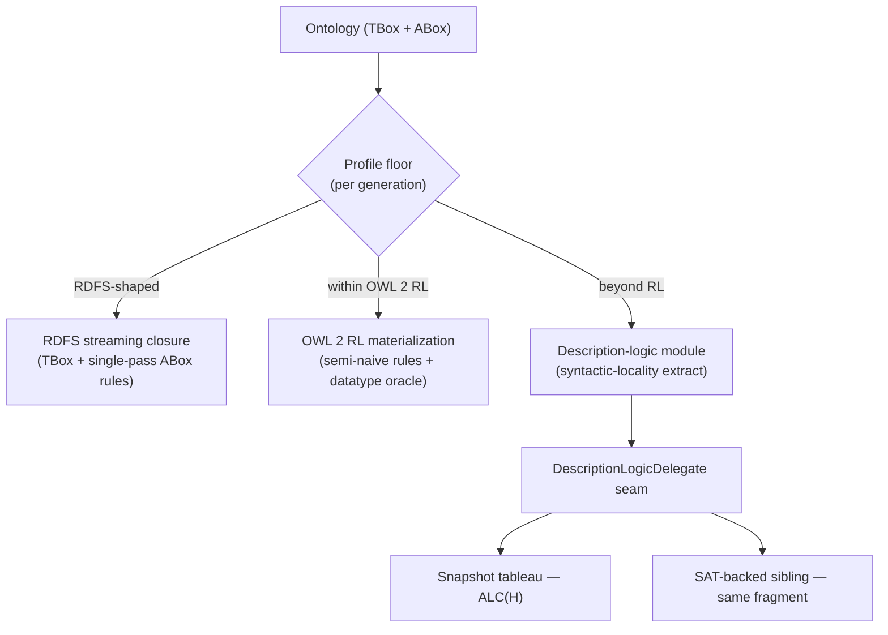
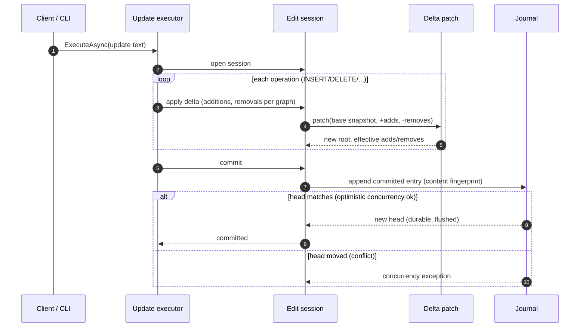
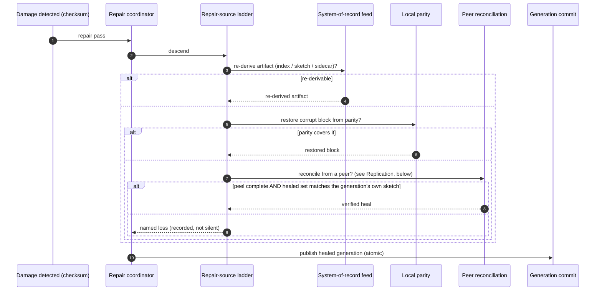
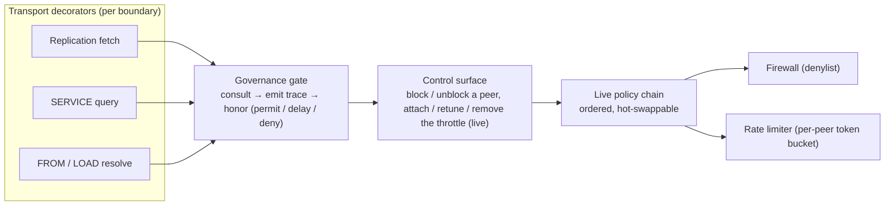
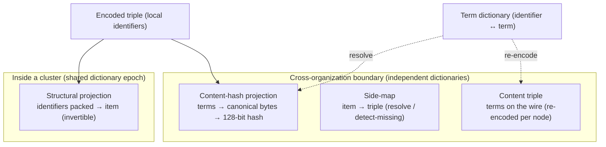

# Architecture

How Veritas is built: the substrate the libraries share, how data is queried, mutated, persisted, and self-healed,
and the design principles that hold across them. For *what* Veritas does and which packages provide it, see the
[README](README.md).

## Design principles

- **Encoded-triple substrate.** Terms are interned once (`Utf8StringPool`) and assigned compact identifiers
  (`TermDictionary`); triples are stored and indexed as encoded values, never as chains of strings. A term denotes
  the same thing across query, validation, reasoning, and serialization without being copied across boundaries.
- **Engine mints are a distinct term kind.** Nodes a reasoning engine introduces — existential witnesses,
  synthesized list structure, scaffold copies — are `EngineNode` terms: content-keyed so re-derivation is
  idempotent, and unconstructible by any parser or converter, so no input document can pre-load facts onto a node
  the engine will mint. Text boundaries render them as deterministic Skolem IRIs or refuse loudly. That
  rendering is one-way: it re-parses as an ordinary IRI, never back into a mint. The term-record codec
  persists them natively.
- **Seam-wired IO.** Storage, hashing, randomness, identity, and network transport are delegate seams. The library
  owns no disk format, hash function, string interner, or socket; a host wires them in. This keeps the core
  transport-free and a peer of credential, identity, and cryptography stacks rather than a dependency of one.
- **Derived artifacts are re-derivable.** One verified feed is the system-of-record; the query index, the
  reconciliation sketches, and the parity sidecars are *derived* from it, so a corrupt derived artifact is
  rebuilt rather than lost.
- **Value-based control flow.** Expected, recoverable conditions are returned as values; exceptions are reserved
  for genuine invariant breaches.

## System context



## Containers



## Store layers — read and write



The columnar triple index is a *derived*, re-derivable view built from the store's triples, and it serves two
roles: the read-optimized **query accelerator** the rendezvous routes acyclic joins to (see *Query execution*
below), and the **reconciliation view** the replication tier compares. The hypertrie stays the system-of-record
query store — the single-pattern, cyclic-join, and access-controlled path.

### Worlds — many-worlds branching over one arena

A mutable dataset can **fork** into an independently evolving *world*: a new dataset over the *same* term
dictionary and node arena, holding the same committed state at the fork point, with its **own journal and
head**. Because every node is content-addressed and interned once, forking copies nothing. The worlds share
all unchanged content structurally, only divergence allocates, and two worlds whose content converges arrive
at the *same* state identifier.

Each world keeps the full linear optimistic-concurrency contract on its own log: commits in different worlds
never conflict. The per-world logs form a DAG through fork entries whose parent names a state produced by the
source world's journal. Diffing two worlds yields the same net per-graph transition shape a commit records.
Dropping a world drops its log; the arena's reachability sweep reclaims whatever no surviving world can still
serve.

A world's log lives behind the dataset-journal seam: the primary world's log can be the durable file-backed
journal, while forked worlds keep in-memory logs. The durable record format rejects fork entries so every
durable log stays self-contained: a fork edge references another journal's state, which a single file cannot
replay alone.

The engine facade carries the registry on a mutable open: the primary world is seeded under a well-known
name, worlds fork, list, drop, and diff by name with value-based outcomes (a diff answers per-graph
transitions decoded to terms), and every execution entry — query, update, streamed select, validation —
takes an optional world and runs against that world's dataset. A fork keeps an in-memory journal beside the
primary world's durable one, so a what-if flow never touches the durable record, and the primary world is
never droppable. The registry records each fork's parent by name, and the facade's listing describes every
world as name, content-addressed state identifier, and parent — the state identifier doubling as the
revision token a caching or streaming consumer scopes by.

The worlds face is wired to every transport tier as a first-party capability, with one wire shape
(`WorldsJson`) whichever tier produced it: the listing document (names, sixteen-hex-digit state identifiers
crossing as text, fork lineage), outcome-token documents for fork and drop, and a **bounded** diff document —
exact per-graph and whole-document totals always, listed triples capped with a truncation flag, terms decoded
server-side to lexical forms. The CLI's `serve` opens its database mutable and mounts the face as `/worlds`
routes beside the pure SPARQL 1.1 Protocol endpoint (listing, fork, drop, world-scoped query and update, and
diff; the strict-JSON request boundary the other first-party routes draw). The in-browser engine opens
mutable and exports the same face over the WASM interop, and the Studio transport seam carries
`worldsAvailable` with never-throw worlds members that degrade exactly like the trace and completion faces —
a generic endpoint or a host without the face reads unavailable and the editor's worlds surface hides.

The editor's worlds surface is the worlds bar plus the Diff result view: a world picker showing the
active world's content-addressed state identifier and fork lineage, a create-a-scenario dialog, a drop
control (the primary is never droppable), and world-routed execution — Run and SPARQL Update execute in
the active world, the buffer routing between the query and update faces on its first post-prologue
keyword while the engine's parser stays the authority, and the debounced live re-query never writes. The
dialog names the scenario, picks its base world, and — when the loaded data declares scenario levers (a
dataset-level vocabulary naming a target, a property, and a range) — presents each lever as a knob
starting at the base world's actual value; the moved knobs compile into one delete-insert update the new
world commits, so a scenario is a fork plus exactly the assumptions that changed. The Diff view renders
the bounded wire document as a table: per-graph headers with exact addition/removal totals, the listed
triples, and an elision note wherever the cap cut a listing. The graph view, the completion vocabulary,
and SHACL validation re-derive per world, so every panel answers for the active world alone.

This is the many-worlds substrate for what-if evaluation — fork, apply a hypothetical, query and diff in
isolation, drop, the flow the Studio's worlds strip drives end to end — and for differential testing of
incremental reasoning maintenance against a fork-and-fully-rematerialize baseline. Counterfactual operators and per-world reasoning materialization build
on it and are in development.

## Query execution

What makes a query fast is not one index but a *shape-aware* choice between two representations of the same
triples, on an encoded substrate that avoids string work. A query's constants resolve to term identifiers
against the dictionary *before* any descent, so an unknown IRI yields no results without touching the store. A
multi-pattern basic graph pattern then joins **inside the data plane**, and the rendezvous (governed by
`QueryEnginePolicy`) routes it by shape:



The **hypertrie** (system-of-record) answers single patterns and rotation-incompatible or access-controlled
joins by **leapfrog worst-case-optimal join**. Every node's children are key-sorted, so the join seeks the
next common key by binary search across the participating iterators and never revisits a key. A triangle
costs ≈ √N·log N, not N. The columnar view drives the same leapfrog descent over its own columns.

Which of the three view-borne routes serves a qualifying query is **one decision per query**, taken by a
**named delegate seam** (`JoinRouteSelector` on `QueryEnginePolicy`) once the view is in hand and before any
route is entered. The decision is **one record over four axes** — route, Free Join depth, trie build, and
batched factorisation — each with a value meaning "not decided, so the engine's standing behaviour applies",
which is what lets a new axis ship without any existing selector acknowledging it. The engine, not a
convention, enforces the order: at one composition site it resolves **policy force > per-query hint
> selector > standing behaviour**, per axis, and records on the decision which axes a hint actually set.

The shipped rule is structural: an **acyclic connected** shape keeps the batched scan-and-hash route (the
measured default), a **cyclic core** or a **disconnected (cartesian)** shape on a six-order view takes the
Free Join generic join, and everything else takes the leapfrog driver. The **calibrated** rule takes that
same route and adds the factorising engagements the view's measured per-key statistics justify; it is opt-in
until the stand certifies it.

A decision is never a correctness statement — every route answers identically, and a route that declines the
shape falls through to the sound default. Each decision rides the trace bus with the shape features it was
taken on, which is the (features, decision) → observed cost pairing an adaptive policy learns from. A
deployment supplies its own delegate, or selects `JoinStrategySelectors.Manual` for the flags-verbatim
routing.

**Per-query hints** (`JoinQueryHints`, passed to the query API) are how a caller that knows its workload
names a route, depth, build mode, or factorisation for one query. A hint is a preference, not a force: it
outranks the statistics and yields to every policy force, an unservable one costs a fall-through and never
an answer, and an access-controlled query is never put to hints at all — the same boundary the selector
seam already draws.

The **columnar view** answers **acyclic connected** joins (detected by GYO reduction) with a **batched
scan-and-hash pipeline** — column-major 1024-row batches, packed join keys, left-deep hash joins, Yannakakis
semijoin reduction — the measured winner and the default. It also drives leapfrog over its own columns for
shapes the batched path declines.

Of the three explicit batched-**columnar-form** entry points, batched columns and batched distinct keys are a
caller's request for that form rather than a route choice, so they stay selector-blind and keep their own
gates. The batched **count** takes the one consultation, since which factorised form counts a shape most
cheaply is a route decision on the same statistics — the Free Join factorised face counts through the
representation where they justify it, and the batched count serves otherwise, both counting the same answer.

The **Free Join** route runs both shapes through one generic join over generalized hash tries, and its flat face
**plans then runs** (`TryPlan`/`Run`, the shape the batched pipeline already has). It builds each relation at the
depth that relation's own key fan-out justifies: its **join-cover depth** by default — trie levels through its
last join variable, the private tail as leaf vectors — extending through that private tail where the fitted rule
says hashing it pays, so one run may carry a mix of depths.

The rule reads the run's shape once and each relation's statistics on their own: a connected run of two or more
tail-bearing relations engages on the heaviest key value multiplied by that tail count, a connected run of one on
the tail's degree-weighted mean key fan, and a disconnected run on that same mean against a bar an order of
magnitude lower, because the cartesian drive re-enumerates a component once per partner row. A composed decision
may override the whole vector to cover or to full. The plan announces its applied depths on the trace bus
(`FreeJoinPlanApplied` — relation count, full-depth count, the cover baseline's tail-bearing count, and the
full-depth bitmask) before it drains, so the depth outcomes of a run join with its observed cost.

A cyclic core therefore descends like leapfrog while a star's satellites take the binary-hash-join shape, and
mixed shapes interpolate between the two paradigms. Its **factorised** output — one group per key with each
pattern's matches kept apart instead of multiplied out — is produced at **join-cover depths**. Every variable
the grouping nests by is a join variable and therefore stays inside the cover, so only terminal emitted values
fall into leaf vectors, where the emission re-establishes the distinctness a hash level would have given it.

The tries build in one of two kept modes (`FreeJoinTrieBuild`): eager hashes the whole trie per query, while the
lazy column-oriented mode materialises each hash node on its first touch and reads leaves through a retained
column store, leaving never-descended subtries unbuilt — answer-identical. The quiet-box soak measured the
build-versus-drive and retained-footprint trade and ruled eager the default: it drives faster on most shapes and
retains a fraction of the lazy mode's values, while lazy stays selectable where deferred materialisation earns its
retained column store. Answer-identical to both defaults, the route is what the selector engages for the two
shapes the batched pipeline declines, and what `PreferFreeJoin` forces for every qualifying shape.

The columnar view is **succinct and encoding-aware**, and it uses **Elias-Fano**. Each compressed-sparse-row
column is encoded independently: monotone value columns as Elias-Fano (the soak-validated default; partitioned
Elias-Fano within groups; the builder keeps whichever is smaller, never enlarging a column), offset columns as
prefixed-delta blocks. Crucially for queries, a descent **seeks** an Elias-Fano column with its rank/select
successor (`NextGEQ` — select to the target's high group, then scan a few low bits), so the structure is compact
at rest *and* probeable in a join, not merely scan-friendly.

Each column is **self-describing** (it carries its encoding's mode tag), and the SIMD decode kernels are
**re-supplied at read time** over a capability ladder (AVX2 → WebAssembly packed-SIMD → 128-bit → portable),
reached through injected delegates. The engine therefore adapts decoding to the hardware without the format
knowing the kernel.

That encoding-awareness is what makes the routing efficient: because the engine knows which orderings are
materialized (three rotations or all six) and each column's encoding, the planner coordinates the
variable-elimination order with the available permutations. It also detects up front a shape no materialized order
can serve (a cycle under three rotations), answering it on the hypertrie instead. Access-controlled reads always
take the hypertrie — the only path with a per-candidate consultation point. Factorized fast paths answer
`COUNT(*)`, `DISTINCT` over star keys, `ASK`, and `LIMIT` without flattening. The strategy ladder is measured by
the benchmark soaks under `test/Lumoin.Veritas.Benchmarks`.

Above the data plane, the algebra executor has a second, **pull-based streaming mode** beside its default
materialising driver (selected per engine by `SparqlEnginePolicy`, default off — the route never changes an
answer, certified by a three-arm differential over the W3C corpus). Eligible plans compile into a pipeline of
row-granular cursors — the BGP leaf over the same batched/per-row sources, the relational operators with the
materialising path's semantics verbatim, non-streamable subtrees as lazy materialise boundaries — serving the
early-exit consumers.

`ASK` short-circuits on every streamable shape, and `EXISTS`/`NOT EXISTS` evaluates per outer row through a
compile-once-per-site plan with a reused, re-armable probe (seeded into indexed lookups where a mechanical
rewrite-set check proves it sound). A `LIMIT` window over count-changing operators terminates upstream production
when it fills — gated to order-preserving chains so the window is positionally identical to the materialising
path's.

Pull nesting is bounded by a per-evaluation cumulative cursor budget threaded through every re-entry channel, and
`EXISTS` nesting by a uniform cap enforced at the parser and defensively at evaluation. Streamed operators report
their provenance at pipeline completion with the rows they actually produced — the early-termination evidence on
the same trace bus as the materialising events.

Between translation and evaluation sits the **algebra rewrite pipeline** — the logical half of query
optimization, distinct from the physical join-strategy selection seam below it. An ordered, frozen list of named
rewrite rules (each a named delegate with a value-based applied/not-applicable/abstained outcome) runs exactly
once per evaluation entry as bottom-up passes over the algebra tree, with fixpoint iteration bounded by a pass
budget whose breach is free soundness — every intermediate tree is semantics-identical, because every rule must
preserve the semantics its kind declares. A rule is one of two kinds.

A **plan rule** — the shipped catalog: unit-join elimination, slice fusion, distinct idempotence, the
parent-keyed no-op projection collapse, restricted empty-table annihilation — is answer-preserving over SPARQL
multiset semantics, certified by answer-identity differential arms over the W3C corpus and by independently
derived per-rule ground truths, and default-off until measured. A **semantic rule** implements a declared
entailment extension: its replacement realizes exactly that extension's specified BGP semantics, so composing it
deliberately changes answers to what the extension defines. It ships in no default pipeline and enters one only by
the caller's explicit composition.

The one shipped semantic rule is the Geo module's topological-relations entry: a basic graph pattern over any of
the twenty-four topological relation properties expands into the union of its asserted route and the
specification's four geometry-backed case rules (feature or geometry on either side, serializations read through
the WKT property, the relation decided by the matching `geof:` predicate function). The expansion is projected to
the pattern's own variables under a set-semantics `Distinct` so a pair answers once however many witnesses derive
it, and it degrades to asserted-only matching wherever the functions are not registered.

The pipeline rides `SparqlEnginePolicy` engine-wide with a per-call override on the evaluation entries; the
default pipeline is empty. `EXISTS` sites compile their inner algebra through the same pipeline once per site.
Each application emits a rewrite-provenance event into the evaluation's trace stream.

The CLI application is such a composing host: it opens every database under one shared options base that registers
the Geo module whole — the function catalog, the serialization datatypes, and this rewrite. The `query` command,
the HTTP endpoint (and the Studio page it serves), and the MCP surface therefore answer the GeoSPARQL extension,
while its replication host inherits the function and datatype surface but keeps the semantic rewrite out of its
pipelines, because replication describes the asserted graph.

The same options base is where a host attaches the engine's execution-trace seam (an options-wired handler beside
the reasoning and storage trace seams; a per-evaluation correlation id is minted whenever it is wired, so
concurrent runs stay distinguishable on one stream). The serve command fans it out as a `/trace`
Server-Sent-Events stream, the in-browser (WASM) host bridges it per event into the page, and both project the one
transport-neutral wire shape — correlation id, sequence, kind, term, detail — that the Studio's trace panel
renders, disabling on a generic endpoint, which carries no such capability.

The database facade's query surface answers all four SPARQL query forms — SELECT bindings, the ASK boolean, and
CONSTRUCT/DESCRIBE result graphs (template instantiation with per-solution fresh blank nodes; the Concise Bounded
Description under a per-call strategy seam) — discriminated on the result value, so a transport renders without
re-parsing the query. A dataset clause resolves through the graph-source seam: a configured resolver serves `FROM`
/ `FROM NAMED` and `LOAD`. With none configured, the engine's store-local source serves the loaded named graphs
for dataset clauses, refusing an unknown IRI by name and never guessing empty, while `LOAD`, whose purpose is
ingesting external documents, stays refused.

The serve command's HTTP face speaks the SPARQL 1.1 Protocol whole over that surface: the three query-submission
forms, the `default-graph-uri`/`named-graph-uri` parameters, content negotiation across the SELECT/ASK results
formats (XML, JSON, CSV, TSV; a `q=0` token is excluded) and the graph serializations (N-Triples, Turtle), the
protocol fault split (400 malformed or unacceptable dataset, 500 refused, 415 unknown POST media type), and a
SPARQL 1.1 Service Description on a query-less GET, generated from live state so the extension-function roster it
advertises is the registry itself. Those graph parameters take precedence over the query's own clause and never
fetch over a network — the serve composition nulls the graph source explicitly, so the store-local source is
structurally the only one.

The evaluator's shipped fast paths — bare `COUNT(*)` from the factorised build's cardinality, `DISTINCT` star
keys, the `LIMIT` leaf row cap, the streaming window, and the `ASK` first-solution short-circuit — are housed in
the **evaluation interception registry**: an ordered dispatch consulted per expand-phase operator, whose entries
answer a subtree, annotate a leaf, or decline, with their guards unchanged and their preference order explicit.
The registry is a separate seam from the rewrite pipeline (interceptions consult engine state and answer with
tables; rules are pure tree transforms), shares the trace vocabulary through interception-provenance events, and
can be switched off as a whole by policy — the differential-isolation arm that certifies, over the full
conformance corpus, that no fast path ever changes an answer.

Beside the triple-shaped engines sits the **value-index seam**: operator-pluggable indexes over the value space of
declared (predicate, datatype) axes, answering locate-shaped queries the triple engines scan for — never
bucketing, aggregating, or filling. A value access method declares either a point axis or an interval pair (start
and end predicates joined on the occurrence subject as an inner join, so a half-assembled interval is invisible,
exactly matching the two-pattern scan), and every method serves the mandatory nearest-predecessor primitive.
Methods compose through a frozen registry whose build-time acceptance ladder (duplicate check, shape sanity, a
differential self-test over registrant-supplied cases) rejects a bad registration at composition, never at query
time. The empty registry is a process-wide singleton with zero query-path cost.

The first registered method is the temporal one: sorted-endpoint indexes on the same implicit-timezone-normalized
instant axis the evaluator compares by — one shared normalization routine, with the binding enforced at
composition (an engine refuses a registered method whose declared implicit timezone differs from its expression
context's). The build indexes only literals whose own datatype classifies into the axis family, and a parseable
lexical under a foreign datatype is dropped exactly as the scan errors it.

Maintenance is drop-and-rebuild: a commit invalidates under the publish lock and the next probe rebuilds against
the pinned store generation, compared by reference so a probe can never pair a stale index with a newer store. The
probe additionally pins the CALLER's evaluation store, declining to the scan when the caller holds an older
snapshot or an update's substituted default graph (`WITH`) rather than the live store.

Probes reach queries through a `value-index-probe` interception behind `SparqlEnginePolicy.PreferValueIndexes`
(default off; the flag selects between evaluation routes only and never changes an answer — certified
probe-equals-scan per shape and by a full-corpus decline arm). Its recognizer matches single-pattern ordering
comparisons on a point axis and the declared interval pair's two-pattern overlap shape, declining equality
operators, cross-family constants, named graphs, and undeclared shapes to the unchanged scan.

A mutable database persists its built indexes as a re-derivable sidecar built from the same captured state as the
columnar sidecar, stamped with the capture's dataset-state identifier and each method's configuration (the
temporal method stamps its implicit timezone). Recovery installs all-or-nothing after digest, structural,
staleness, and configuration validation, and any refusal falls back to the always-correct cold rebuild. An
on-demand census partitions a graph's registered-datatype literals into declared and undeclared entries, so a host
whose value annotations live outside the registered axes sees that state rather than running silently
unaccelerated.

Beside it sits the **epistemic-reason seam**: one registry for the stable reason codes the engine's reasoning
decisions report through. A reason code is a value identity: an int whose high digits carry the class family and
whose low four digits carry the code, so a consumer recovers the family by integer division without a string parse
or a registry lookup. Every code carries a canonical UTF-8 name as the human-facing source of truth and a cold,
in-process explanation of why.

A registration declares its class family (a reserved digit band), canonical name, explanation, and projection
coverage; an explicit deferred coverage is a valid declaration, an absent one is not. It composes through a frozen
registry whose build-time acceptance ladder (collision check across codes, names, and band reservations; shape
sanity; a self-test resolving every code and declared projection through the tentative freeze) rejects a bad
registration at composition, never at query time. The empty registry is a process-wide singleton with zero
query-path cost, and the seam joins the engine options dark by default beside the value-index registry. Codes are
append-only: never deleted, never renumbered, so anything keyed by a code inherits its stability.

The first minted family mirrors the reasoning strategy-selection vocabulary: six codes whose canonical names are
the selection-reason enum's member names, registered beside the unchanged enum. Three further families are minted
(deferred coverage). Band 2 `DerivationOriginKind` names whether a derived head stands independent of any
unresolved disjunct (`DecidedUnderNoChoice`) or rides an unrecorded choice (`DerivedUnderChoice`), band 3
`ConditionalityLossLint` names its single `ConditionalityDropped` code, and band 4 `EntailmentRule` mints one code
per entailment-rule identity behind the unchanged `EntailmentRules` string catalog. Its canonical names are the
rule wire strings themselves, so the registry resolves any fired rule while the bare-string surface the
materializers emit and the pins compare stays byte-identical.

Beside them the context-saturation engine carries a default-off conditionality-loss lint: a dark,
zero-cost-when-unarmed census latch at the clause-addition funnel that counts derivation steps whose head is
strictly narrower in choice-conditions than the union of its premises' disjuncts. The latch is a ground-truth-free
mechanism detector, never a soundness gate.

Beside them sits the **value-datatype seam**: one registry (`ValueDatatypeRegistry`, in the RDF layer's value
space) for the datatype IRIs whose lexical spaces the engine does not model itself. A registered definition owns
one datatype IRI and declares which of two questions it answers — the lexical validity of one form, the value
identity of two forms under the same datatype. Every answer is three-valued with abstention at ordinal zero, so
a definition that cannot decide a question leaves the built-in semantics standing.

Exactly two consult sites exist, each guarded to a non-empty registry. The SHACL `sh:datatype` lexical check
consults a declared `LexicalValidity` facet where its typed families end — a definition can then reject an
ill-formed lexical form the unregistered engine accepts on IRI identity alone, the seam's one behavioural delta
for a registering host. The SPARQL `=`/`!=` comparison consults a declared `ValueEquality` facet immediately
before its term-identity fall-through, only when both operands are literals carrying the same registered
datatype IRI. A decided answer settles the comparison, an abstention falls through to term identity.

A union reservation gate makes the built-in semantics authoritative structurally rather than by convention: the
whole XSD namespace, the whole RDF namespace, and every datatype the engine's own value-space classifier models
are unregistrable, so no XSD-typed and no language-tagged literal can ever reach a registered definition.
Registration is value-based composition: duplicate, facet-less, over-budget, reserved, and law-violating
definitions are declined as typed outcomes on the builder's ordered record, never thrown, with a bounded
equality-law check (reflexivity, symmetry, transitivity over the definition's declared probe forms) run at
registration. The empty registry is a process-wide singleton that joins the engine options dark by default
beside the two sibling registries, and with nothing registered every consult site is byte-identical to the
seam's absence.

This registry and the OWL concrete-domain registry (the operator-registered datatype seam under *Reasoning and
validation* below) are **two jurisdictions by design**: this one answers per-form validity and pairwise value
identity for the RDF value layer and is never consulted by the reasoner arms, while that one answers
facet-conjunction satisfiability and value counting for the reasoner and is never consulted by the value layer.
Their abstention semantics are opposite: a value-layer abstention keeps the exact term semantics standing, while
a reasoner abstention is a named undecided module.

The first registrant is the GeoSPARQL layer (`Lumoin.Veritas.Geo`): the six geometry serialization datatypes.
The five OGC-named ones each declare lexical validity only while value identity abstains, keeping `=` at term
identity.

Each is a one-pass span recognizer with a shared four-valued outcome whose abstentions accept: `geo:wktLiteral`
(CRS-prefix decomposition plus the well-known-text recognizer; curve tags and the nesting cap abstain);
`geo:gmlLiteral` (an XML fragment scanner shared with the KML recognizer; the documented profile is the geometry
elements of GML 3.2, OGC 07-036 — certified content models for the point, curve, polygon, and aggregate elements
with their member wrappers, everything else in the GML namespace abstaining, and a non-GML namespace provably
invalid); `geo:geoJSONLiteral` (an RFC 7946 geometry-object recognizer over exact RFC 8259 tokens; the
datatype's lexical space carries no spatial reference system, so a top-level `crs` member is invalid and CRS84
is the meaning by definition); `geo:kmlLiteral` (the OGC KML 2.2 geometry elements with the coordinates tuple
grammar; likewise CRS84 by definition); and `geo:dggsLiteral` (the angle-bracket DGGS IRI prefix with its
required whitespace separator certified for every grid, plus the whole cell-set body when the IRI names the
house A5 grid, while the geometry data abstains for every non-empty FOREIGN-grid body — the standard delegates
its formulation to the DGGS the IRI identifies).

The sixth definition is the house DGGS subclass `a5Literal`, which names the implementation per the standard's
subclass guidance. Its whole grammar is certified: the prefix must carry exactly the house A5 grid IRI and the
body is a `CELLS` roster of decodable cell ids. It declares value equality, deciding `=` by canonical cell-SET
identity (deduplicated, sorted; never collapsed through the grid hierarchy, because child cells only
approximately tile their parent, so same-valued literals materialize bit-identical geometry).

The empty lexical form of every serialization denotes the empty geometry, and the `geof:` operand seam answers
that empty form itself — one whitespace scan standing ahead of every codec dispatch, because no codec grammar
has a reading for a body with no content. For the two DGGS datatypes the empty form is the zero-length literal
exactly, because a whitespace-only form carries no IRI prefix and its grammar gives it no interpretation.
Recognition certifies token shape and structure at the level the referenced grammar fixes it, never value
semantics or counts — no form a standard admits is ever rejected. Nothing registers the definitions by default,
a composing host does.

Behind three of those datatypes sits the **geometry serialization codec layer** (`Lumoin.Veritas.Geo.Xml` and
`Lumoin.Veritas.Geo.Json`): readers and writers carrying GML 3.2, RFC 7946 GeoJSON, and OGC KML 2.2 geometry
documents into and out of the flat geometry model, with the two XML formats sharing one fragment scanner as
their transport floor. **The datatype layer and the codec layer are two jurisdictions**: a registered definition
proves a lexical form's shape or abstains, and never materializes a value; the codecs are the ingestion
authority, deciding what an accepted body *means* and refusing everything they cannot represent.

Refusal is by value over one closed twelve-member reason roster — no refusal, malformed document, prohibited
construct (the security floor: document type and entity declarations, processing instructions, remote-reference
members, vendor extensions), unsupported geometry, unrecognized coordinate reference system, dimension mismatch,
non-finite coordinate, structural violation, nesting too deep, trailing content, unrepresentable measure,
unrepresentable empty — each paired with the first offending byte, so a consumer switching over the set is
exhaustive and stays exhaustive. Nothing is rented before a document is wholly accepted, and a writer validates
the whole geometry before its first destination write, so a refused read leaves nothing to dispose and a refused
write leaves the destination untouched.

A reader returns the coordinate reference system beside the value in that system's own declared axis order and
never transforms: GML recognizes its root declaration against the certified roster, and GeoJSON and KML fix
CRS84 by their formats' own rules. No format carries an M ordinate, so a measured geometry refuses rather than
losing its measure silently. Kind carriage is one-way where a format is narrower than the model and the
asymmetry is documented rather than hidden: KML collapses the linear ring into its closed line string and every
typed aggregate into the single heterogeneous aggregate, expresses no empty geometry at all, and admits the
ring-less interior boundary its content model allows as contributing no interior ring — the exterior boundary
ring stays required by the format's own normative prose.

GML's curved inputs — the circular segment types — arrive through a **certified arc linearization tier**:
inscribed chord polylines built by bisection and verified per emission by exact predicates, every chord's
midpoint sagging inward by at most 2⁻¹⁶ of the certified radius and every emitted vertex sitting within 2⁻²⁰ of
it, with a bisection depth cap of sixteen and refusal — never a shipped approximation — wherever the arithmetic
cannot certify. The construction uses only correctly-rounded arithmetic and square root, so its output is
bit-identical across conforming machines.

The tier is not planar-only: a three-point `Arc` or `Circle` whose control points carry a third ordinate —
declared at the root, at an ancestor, on the carrier, or inferred from a bare token run — linearizes through a
plane-embedded kernel over the same exact predicates, the certified object being the intersection of the
computed sphere with the exact plane through the three document points. Every emitted vertex lies within 1.35e-6
times the computed radius of that circle, the control points enter the output verbatim in all three ordinates,
the computed centre clears an exact planarity band once per arc before any vertex is checked, and segments join
over the third ordinate with the earlier copy's bits kept. The centre-and-radius circle stays two-dimensional
permanently: a centre and a radius alone carry no plane in three-space, as the format's own annotation states,
so admitting a three-dimensional instance would mean fabricating one.

Depth is bounded twice from one number: the certified **geometry** nesting bound is thirty-two levels for every
codec and every recognizer, and each tokenizer's **transport** bound is derived to carry it — ninety-six
structural levels, above the worst structural cost a geometry-thirty-two document can reach. The transport layer
therefore never refuses on depth a body the geometry bound admits, and the derivation is restated per scanner
rather than assumed across them.

Over that refusal currency sits the **geometry-literal diagnostics projection** (`GeoLiteralDiagnostics` in
`Lumoin.Veritas.Geo`): a tooling face that answers, for one datatype IRI and one literal body, a four-state
diagnosis carrying the refusal's kind and first offending byte. It is a projection exactly, consulted by no
evaluation path: the `geof:` operand seam still answers the bare SPARQL error value, and a registered datatype's
verdicts are untouched. The well-known-text reader and the DGGS scanners answer the same twelve-kind refusal
currency with located offsets so all six geometry datatypes diagnose uniformly, and the well-known-text dispatch
re-bases every offset past the stripped CRS prefix so the byte always indexes the full literal body.

Severity is structural, never a judgment table: the datatype's own lexical layer runs first, a lexically
malformed body is *invalid* (the validator itself rejects it), a lexically tolerated body the codec reader
refuses is a *warning* (legal data the engine cannot evaluate), a readable body is *valid*, and a datatype
outside the six is *unsupported*. The diagnosis is therefore never stricter than the validator on the invalid
axis, an invariant a corpus-wide agreement battery pins.

The face reaches every tier as one wire document: the serve host maps it as its own `POST /literal-diagnostics`
route beside the trace stream, the in-browser engine exports it through the interop face, and the Studio editor
paints offset-precise marks from whichever source is active. A generic SPARQL endpoint carries no such face and
the editor paints nothing there, the same first-party capability degradation the trace panel follows.

The editor's **completion faces** travel the same tiered wire. Parser-driven completion — the SPARQL grammar's
admissible-next-token context with in-scope variables datatype-resolved against the live dataset, and the
Turtle-family context for a Turtle / SHACL / TriG buffer — and the fixed editor vocabulary are first-party
capabilities of the Studio transport seam beside the trace stream and the diagnostics face. The serve host maps
`POST /completion` (resolving variable datatypes against the store it serves), `POST /turtle-completion`, and
`GET /editor-vocabulary`. The in-browser engine exports the same three faces over the interop boundary. The
desktop bridge relays them across its correlation-keyed message channel. A generic SPARQL endpoint carries none
of them, so the editor degrades to its token-heuristic proposals.

The context documents are written by one writer per grammar (`CompletionContextJson` in `Lumoin.Veritas.Sparql`,
`TurtleCompletionJson` in `Lumoin.Veritas.Turtle`, the literal-diagnosis document by `GeoLiteralDiagnosisJson`
in `Lumoin.Veritas.Geo`), so every host serves byte-identical wire shapes. The vocabulary corpus is composed at
the host: the core RDF vocabularies (`Lumoin.Veritas.Database`'s `EditorVocabulary`) take a contributed
GeoSPARQL group set (`GeoEditorVocabulary`) and the composition's registered value datatypes, enumerated from
the value-datatype registry's discovery face. A datatype IRI covered by a contributed roster rides as its
prefixed name, an uncovered one as a bracketed full IRI, which is how the A5 DGGS literal datatype reaches the
completion popup without a fabricated prefix.

**The A5 DGGS kernel** (`Lumoin.Veritas.Geo.Dggs`) is the house cell substrate behind the DGGS datatypes: 64-bit
cell identity over the pentagonal equal-area grid at resolutions 0 through 30 with canonical big-endian byte
order, parent/child navigation, compaction, region fill, line and disk traversal, and runtime-selected SIMD
point-to-cell batch kernels behind one facade, all pure math over the base class library and formula-exact
against a frozen, hash-pinned fixture corpus. The cells-to-geometry bridge materializes a cell set as the
polygon or multipolygon of the cells' boundary rings in CRS84, with orientation normalized computationally by
signed area. It refuses, as a value, every cell whose boundary is not planar-faithful in CRS84
(antimeridian-straddling and polar cells, whose unwrapped vertices leave the canonical longitude range; geodesic
splitting is the named fix when coordinate transformation lands) as well as cell sets containing an ancestor
with its own descendant (structurally overlapping polygons).

Through the one operand seam every live `geof:` function and spatial aggregate extends to house-flavour DGGS
literals structurally, and `geof:asDGGS` converts geometry to the covering cell set at the resolution its
datatype argument's `?resolution=` query carries. The standard's signature has no resolution parameter, and no
default is fabricated.

**Extension functions** are the second host-extensible seam in expression evaluation. A function-call IRI
resolves in one order — built-in XSD constructor cast, then the registered extension functions, then the
expression error value — so an unknown IRI is a SPARQL error term rather than a throw, and evaluation continues
under the error's own semantics (a `FILTER` drops the row, a `BIND` leaves the variable unbound). The whole XSD
namespace is reserved against registration, so no future built-in can be shadowed. Arguments reach a function
already evaluated, and an error in any argument short-circuits before the function body is consulted, so
implementations only ever see bound terms. Nothing is registered by default.

**Extension aggregates** ride the same registry as a second face on the same entries: an entry carries a scalar
implementation, an aggregate fold behind its own nominal delegate and group-carrier types, or both, and the
frozen registry exposes its declared aggregate-IRI profile. Recognition is translation-time and profile-driven:
a function-call IRI in the declared set lifts into the aggregation algebra exactly as a keyword aggregate does,
implicit grouping included, through every projection, `HAVING`, `ORDER BY`, and sub-`SELECT` position. One
engine therefore always reads one meaning, and under the empty profile every IRI call stays a scalar.

The argument list's leading `DISTINCT`, which the grammar reserves for custom aggregate calls, parses on any IRI
call and deduplicates the fold's inputs by RDF term identity. A `DISTINCT`-marked call that stays scalar answers
the expression error value ahead of every dispatch branch, the constructor casts included.

Per group member the engine evaluates the one aggregate argument and hands the fold bound values only. A member
whose argument variables are unbound drops — the `COUNT` discipline over `OPTIONAL`-shaped data. An evaluation
error over a fully bound member fails the whole aggregate, because an answer over silently fewer members would
describe a different group.

The `geof:agg*` spatial aggregates are the first registrants: each folds a group's geometries as one combined
geometry under its scalar counterpart's semantics, the one-CRS gate applies group-wide with the explicit-prefix
carriage following any member, and the empty group answers the error value.

The GeoSPARQL layer is the first registrant here too. Under the vocabularies sits a **planar Simple Features
geometry model**: geometry is held as flat coordinate columns with a node and part table over them rather than
an object graph. The columns come from a caller-bound allocator seam, so a pooling host's rentals are owned by
the built geometry and returned on disposal, while the heap default disposes as a no-op. The well-known-text
reader and writer close over it with a canonical emission that round-trips coordinates bit-exactly.

**Topology is decided by exact orientation predicates, never by tolerance**: every sign that decides a
topological question is computed exactly over the operands' original coordinates, and computed intersection
coordinates serve only as node identities. On that floor sit the full DE-9IM intersection matrix and its pattern
test, the twenty-four named topological predicates of the Simple Features, Egenhofer, and RCC8 families, a total
simplicity test, boolean overlay, buffer, convex hull, the effective-dimension centroid, the certified covering
circle (every operand vertex exactly inside-or-on the answered circle, the cover decided by an exact excess
predicate and a fired radius lift landing on the smallest representable covering double), and the concave hull
over an internal cavity Bowyer–Watson triangulation whose cavity gate is a second exact predicate, the adaptive
incircle sign. The concave hull is the one exact path that allocates, on a caller-held plain-heap carrier rather
than a pool.

Constructive results are always freshly built, planar, and canonically ordered, and never alias their operands,
so disposing an operand cannot invalidate a result. Two identical calls answer bitwise-identically, which is
what lets the conformance rows assert exact text rather than fall back to topological comparison.

Beside the geometry model, and deliberately **not wired into any query, relate, or overlay path**, sits a
**bulk-loaded packed R-tree over bounding boxes**: one ingest of an item sequence, then box-intersection and
both box-containment directions as candidate enumerations over pooled structure-of-arrays columns. Two
packing families — Sort-Tile-Recursive and a Hilbert-curve order — share one engine, one layout, and one
query path, so the ordering pass is the only degree of freedom and candidate sets are identical across every
configuration. What a configuration changes is clustering quality and traversal cost. The index is a
deterministic function of (options, item sequence): every ordering element carries a unique tie-break index,
so no sorted sequence depends on a sort algorithm's tie behaviour, and enumeration order is contractual per
configuration.

Build refusal is destructive and total: any non-finite ordinate or inverted axis refuses, leaving the index
empty. Queries are enumerators rather than `Try` shapes. Every per-query rental — the traversal stack, and
the containment route's collect buffer — is owned by its enumerator, so nested, interleaved, and concurrent
enumerations are all legal. A build version makes a rebuild or dispose under a live enumerator fail loud
instead of reading stale views.

The containment direction is answered by an **embedded four-axis dominance tree** rather than the packed
union-bound walk. A union of many small disjoint boxes is wide and would degrade that walk toward linear
node visits, where the dominance descent composes a subtree-union prune with a per-coordinate half-space
prune and stays sub-linear on exactly that shape. The dominance structure materializes once per built epoch,
at the containment route's first use by default or at the build tail as a selectable carriage, under an
internal lock that leaves every other mode lock-free. Candidate sets and the contractual per-packing
emission order are unchanged by the route, because matches emit sorted by a preorder emission rank fixed at
materialization.

Beside it sits the **standalone containment-only structure** (`BoxContainmentIndex`): a dominance k-d tree
answering only "which stored boxes contain this query box", for a consumer whose workload never asks the
other two questions. Between the two, **the packed index's containing mode is the adopted containment
path**: a digest-gated head-to-head across ordinary and adversarial workload shapes measured it ahead on
every containment regime, so a consumer answering the containment question builds the packed index unless
its own measurement says otherwise. The standalone structure stays selectable. Neither is wired into query
evaluation today; the first query-engine consumer carries its own measured wiring.

The `geof:` catalog binds that model to expression evaluation, and the **error discipline is the seam's
contract**: a refused operand kind, a malformed argument, and a detected inconsistency in the represented
arrangement all answer the expression error value, while a degenerate but defined geometric result — a typed
empty, an eroded-away buffer, a degenerate hull — is an ordinary literal. Every geometry argument arrives
through **one operand seam**, and that seam reads all six serialization datatypes: a `geo:wktLiteral`
decomposes its CRS prefix and parses through the well-known-text reader, a non-empty `geo:gmlLiteral`,
`geo:geoJSONLiteral`, or `geo:kmlLiteral` body parses through that format's codec, a DGGS literal
materializes through the cell bridge, and a body carrying no content denotes the empty geometry ahead of
every codec dispatch. A GML operand carries the system its root declared, as that roster member's canonical
IRI whichever accepted spelling the document wrote, so axis-order resolution, unit conversion, and
re-emission all compare one spelling. GeoJSON and KML operands carry the CRS84 default their formats fix. A
codec refusal answers the expression error value, never an exception.

Every live function and every spatial aggregate inherits that ingestion through the one seam, with no
per-function work, and three functions serialize back out of it. `geof:asGML` preserves the operand's own
system, always declares its canonical IRI on the root, and refuses a system outside the certified roster
before anything is written, the format's declaration being closed to that roster. A defaulted operand
answers a document naming CRS84 outright. `geof:asGeoJSON` and `geof:asKML` re-express through the
coordinate-operation surface into CRS84 first, the system both formats fix and neither declares. A refused
re-expression answers the error value rather than a clamped or wrapped coordinate, and a Z-carrying or
measured operand under a required re-expression refuses rather than losing an ordinate. KML expresses no
empty geometry at all, so `geof:asKML` over an empty operand answers the error value rather than a
fabricated document.

Magnitudes answer in the geometry's own coordinate units under the certified roster's declared units. A
roster system answers exactly its declared unit, so a metre-denominated answer over declared-degree
coordinates is refused rather than fabricated, while a system outside the roster answers the metre unit by
the explicit-CRS convention and never the degree unit. Binary and aggregate functions require their operands
to share one system, because the catalog never inserts an implicit coordinate transformation.

Coordinate tuples carry the declared axis order of their system. Within the certified roster the coordinate
extrema resolve X and Y through that order: X names the east axis and Y the north axis, so both geographic
spellings of one geometry answer alike. A system the roster does not recognize answers in the literal's own
written order, and the shared-system requirement means tuples of differing declared order never meet in one
computation.

The one explicit transformation point is `geof:transform`, backed by a dedicated **coordinate-operation
surface** over a closed certified roster of exactly three systems — CRS84 (longitude-first), EPSG:4326
(latitude-first), and EPSG:3857 Web Mercator — recognized from their canonical IRIs by ordinal equality
alone, with every ordered pair certified. An unsupported pair is therefore unrepresentable, and refusals are
always about identifiers or coordinates. The surface validates the whole interleaved coordinate span before
its first destination write and answers a typed refusal by value: no clamping at the Mercator latitude
limit, no longitude wrapping, and the Web-Mercator-to-geographic direction refuses the ulp-scale boundary
slivers whose computed image the reverse leg would not accept back. The function maps every refusal to the
expression error value, transforms a geometry's whole vertex column in one call, and refuses 3D and measured
operands rather than dropping or fabricating a third ordinate. It always emits the explicit target-IRI
prefix in the target system's declared axis order, a deliberate divergence from the catalog's
carry-the-source-prefix emission: this function's answer names the requested system.

Where the specification leaves a shape parameter implementation-defined the catalog owns it and documents it
in place. The covering circle is answered as a centre and a certified radius by the substrate and
polygonized at the catalog's arc tessellation into the **certified circumscription** of that circle. The
circumradius seeds at the radius over the cosine of half the tessellation step and ratchets one bit upward
until the emitted ring passes an exact per-emission verification: octant roster and single winding, strict
convexity, the centre's side of every edge, and every edge line's squared distance against the squared
radius, all decided by exact predicates and expansion arithmetic.

Coverage of the whole disc, and with it every operand point, is therefore verified rather than assumed, and
an unverifiable emission answers the error value rather than an approximation. The polygon exceeds the
certified circle by at most sec(π/32) − 1 of the radius — under half a percent, from the exact secant form.
The circumradius must be resolvable at the centre's magnitude, and operands beyond the exact predicates'
documented magnitude walls answer the error value. The concave hull is single-argument at the seam, taking
the catalog's documented default concaveness ratio.

Above the catalog sit the module's two query-answering routes for the topological relation properties. The
**topological-relations rewrite entry** (the shipped semantic rule of the algebra rewrite pipeline, under
*Query execution* above) expands relation-property graph patterns into their geometry-backed derivations.
Beside it, the **RCC8 composition calculus** derives new relations from asserted ones symbolically, with no
geometry anywhere: the full composition table with its converse map, and a worklist closure that emits exact
converses and materializes a composed relation only where the table cell is a singleton. A disjunctive cell
is knowledge about mutually exclusive possibilities, not an assertable triple, so the closure stays silent
there.

Singleton-cell materialization is monotone and terminates. Deciding full network consistency is deliberately
out of scope, and the run reports whether the closed graph respected pairwise disjointness at all. The
table's internal laws (identity, converse symmetry, the pinned singleton roster) and its agreement with the
computed predicates are certified by a geometric witness sweep over a region family that exercises every
cell.

Expression evaluation compares values through **one shared comparator** (`RdfValueComparer` in the RDF
layer). The filter operators map the temporal families (`xsd:dateTime`/`xsd:dateTimeStamp`, `xsd:date`,
`xsd:time`) to the XPath operators per SPARQL §17.3, with timezone-naive operands normalized by the
**implicit timezone**, so temporal ordering is total and never indeterminate. That implicit timezone is UTC
by default, host-configurable on the expression context, and captured once per evaluation like `NOW()`. The
SHACL/OWL consumers keep the XSD ±14h partial order through the comparator's non-normalizing entry.

The temporal value type carries the full XSD 1.1 proleptic axis (year 0000, negative years, the 24:00:00
end-of-day form) on wall-clock fields wider than `System.DateTime`. `ORDER BY`/`MIN`/`MAX` sort literals on
a **class-rank partition**: every numeric datatype one value-ordered class, each temporal family one
instant-ordered class, every other datatype its own lexically-ordered class, classes ranked by their least
member datatype IRI. A mixed-datatype sort is therefore transitive by construction, with value-equal
literals ordered by a deterministic datatype-then-lexical tiebreak. One recorded boundary: `=`/`!=` on
temporal literals keep RDF term equality (record equality). Value-equality unification is a recorded
follow-on, and the independently derived ground-truth table pins both sides of that line.

## Graph analytics

The store doubles as a graph-computation substrate, and the coupling is direct rather than exported: the
columnar index's subject-ordered rotation *is* the out-adjacency and its object-ordered rotation the
in-adjacency. Degree and edge-scan passes therefore read the query index itself, and traversal-heavy
algorithms build a transient flat compressed-sparse-row projection over a selectable predicate and graph. On
that substrate the engine ships degree statistics and distributions, connected components, triangle counting
and clustering coefficients, PageRank, clique enumeration (driven by the same worst-case-optimal
intersection the join engine uses), closeness, betweenness, and eigenvector centrality, strongly connected
components, k-core decomposition, and unweighted single-source shortest-path lengths.

Every algorithm is reachable four ways — the CLI, the MCP tools, the HTTP endpoint, and in-process SPARQL
`SERVICE` calls that render ordinary result sets — and every run is bracketed by trace events. Analytics
honor access control the same way queries do: a filtered view threads the caller's access context so an
algorithm never reads a triple the caller could not query.

Two boundaries are deliberate and named. Edge *attributes* have their representation: RDF 1.2 triple terms
are first-class in the store, the parsers, and query matching. The analytics tier does not yet consume them,
so weighted variants — weighted shortest paths foremost — await that wiring. The second boundary: algorithms
return scores and memberships, not materialized paths, and reachability is available through SPARQL property
paths, which are set-valued by specification.

Beyond descriptive statistics, the tier has an architectural role: it is the **integrity-constraint layer for
relations the description-logic fragment cannot express**. The concrete case is part-whole modeling: proper
parthood is transitive, asymmetric, and irreflexive at once, and OWL 2 DL's role-simplicity restriction
forbids declaring a transitive role asymmetric or irreflexive. No conformant reasoner can carry that
contract. The graph tier can: acyclicity of the parthood relation is a strongly-connected-components pass
over the ACL-filtered projection whose components larger than one are exactly the violations. Constraints of
that family — asymmetry and irreflexivity of asserted relations, acyclicity of hierarchies — are graph-level
checks by design here, not missing reasoner features.

## Reasoning and validation

Veritas aims to reason at the level of the best dedicated engines while remaining a database, and that goal
is concrete and measured on four axes. **Soundness is the floor and is not traded for reach or speed:** a
verdict is correct for what it claims to cover or it is explicitly abstained. That floor is held by
ground-truth verification: every capability the fast path adds is pinned by an explicit witness (a
hand-built model for a consistent case, a refutation for an inconsistent one), because the general decider
is by construction blind to the constructs the fast path is extending and so cannot serve as their oracle.

**Reach** grows the tractable, polynomial-time fragment the consequence-based classifier decides toward the
frontier of what is decidable without model construction, holding OWL 2 RL conformant and treating OWL 2 QL
as an on-demand addition. **Performance is pay-as-you-go:** the saturation path is made to decide an
ever-larger share of real ontologies. The consequence-based context tier now saturates the non-Horn residual
too — disjunction, full negation, qualified cardinality above one, and object nominals, by ordered
resolution over disjunctive heads with a ground root context — so the model-constructing general decider is
entered only for the residual beyond it, principally the guarded nominal co-occurrences and the undecided
data shapes. That share is not asserted but measured: a benchmark stand runs the engine matrix over real
corpora — synthetic families, the OWL 2 profile TBoxes, and an inverse-heavy ontology — and reports the
fraction of modules the polynomial path decides versus delegates, plus classification and satisfiability
time and allocation per engine. A reach step must therefore move that fraction, and no timing regression
hides.

And the **database axis is co-equal:** derived facts are maintained incrementally as data changes, under
retraction as well as assertion, so reasoning keeps pace with a store that is used like a store. A mutable
database opened with reasoning maintains its OWL 2 RL closure per commit through an incremental
delete-and-rederive pipeline rather than rematerializing, and the maintained closure is what queries serve.

Inference is layered by the expressivity an ontology actually uses, not by one monolithic procedure: a
profile floor is detected per store generation and the cheapest sufficient strategy runs. Every layer
commits its conclusions through the journal, so a derived triple carries the same provenance as an asserted
one and a re-derivation is a replay rather than a special case. A delegated module is reasoned as handed in:
resolving an ontology's `owl:imports` closure is the caller's obligation, discharged before the module is
constructed, and the import marker itself passes through every layer as non-logical.



- **RDFS** closes as a specialized streaming pass — the TBox closures and the single-pass ABox rules — not the
  general engine.

**OWL 2 RL** materializes the RL/RDF rule set to a fixpoint with a pluggable datatype oracle for value-space
falsities; an inconsistent closure commits nothing. A **maintained closure** keeps a computed RL closure equal
to the from-scratch closure while its base evolves by add and retract sets: deletion candidates propagate
forward through the same rule bodies over a deletion frontier (over-approximating is sound), a head-bound
backward matcher — one entry per producer rule — restores every candidate that still has a derivation from the
surviving state, and the semi-naive insert rounds finish the fixpoint. Support is recomputed, never stored: no
per-fact bookkeeping outlives an edit, so resident state stays proportional to the closure itself.

Physical removal batches the deletion set per touched index key and compacts each touched list in one sweep,
and the backward matcher's presence probes are hash lookups against the accumulated set, so a deletion
cascade's cost tracks the facts it touches rather than the density of the keys it lands on. Rule reads that
select one value from a multi-valued node (restriction fillers and bounds, negative-assertion parts, list
cells) read the canonical minimum term identifier, so maintained-versus-fresh equality is well defined even on
malformed inputs. An edit — or a deletion cascade — that touches such a read re-processes the owning construct
in both directions, tearing down the old choice's conclusions and re-firing the new one's with live falsity
checks (a pure retract can therefore surface a new inconsistency).

The maintained engine is internal and unwired until its measured gate; the from-scratch materialization
remains the production path. An opt-in, thread-local, default-off phase instrumentation attributes a
maintenance pass's cost to its pipeline phases (marking families, physical unindexing, rederivation, insert
rounds) for the value-chain soak's profile lane; every site is a single guarded branch when disabled, and
verdicts are identical either way.

The RL entailment checker carries a comprehension mode granting the RDF-Based semantics' informative
comprehension conditions in two halves. The embedding strips a conclusion's pure-existence expression
scaffolds at check time, and the contentful scaffolds — expression structure the conclusion also makes claims
about — are minted into the per-call premise under fresh blank labels, with a flag-gated comprehension
completion family deriving the granted structure's consequences inside that closure alone. Minting demands the
premise force every named argument's class or property standing, exactly one constructor application per node,
and acyclic lists; anything else refuses and the conclusion stays unsettled.

The family also carries the bounded existential witness. Each (someValuesFrom, onProperty) pair on a
restriction states an independent existential over the members, realised by a fresh deterministic witness per
member, restriction, property, and filler — never shared, because a shared node would assert an unentailed
coincidence. The unfolding refuses a restriction repeating on the witness chain, so every chain is a simple
path over the finite restriction set and the fixpoint terminates.

The family further carries the schema completions the iff conditions grant. A declared domain of `rdf:type`
subsumes every class the closure evidences — explicit `rdfs:Class` or `owl:Class` typings, `rdf:type` objects,
`rdfs:subClassOf` positions, and domain or range objects, each emission citing its witness — and brackets
`owl:Thing` in both directions (ICEXT is the `rdf:type` slice, so the declared domain's extension is the whole
universe and scm-eqc2 composes the equivalence). Two functional properties sharing one has-value node as
domain and onProperty target collapse to equivalence. A property ranged by two datatypes with disjoint value
spaces — answered by the oracle across value-space families — has the empty extension, subsuming under every
typed and every predicate-position property while statement-free and contradicting on any asserted statement,
the family's one falsity.

The family also retypes a literal whose type IRI is held `owl:sameAs` a datatype-map member onto the member's
own lexical-to-value map — literal denotation runs through the datatype the type IRI denotes. The entailment
surface complements it with the `dt-eq` value-identity bridge: a closure literal and a conclusion literal the
oracle knows denote one value, within one value space, seed their sameAs so the equality rules derive the
conclusion's own spelling; a clash unique to the bridged run refuses the bridges. Independent of the mode, the
equality scan in every engine refuses an `owl:sameAs` between two datatypes of disjoint value-space families
as the datatype map's identity contradiction, the literal-distinctness falsity's sibling. The
canonical-closure variant's merge walk carries the same refusal, since canonicalization consumes the identity
edge before its inner closure runs.

The family also propagates fibre-cardinality count certificates. A singleton enumeration anchors a count-1
class, an equivalent cardinality restriction on an inverse property converts a proven count through the
property's fibres — a count above one demanding the consuming property functional, because only disjoint
fibres sum to the product — and the anchored read-back pins a counted bound `owl:sameAs` the minted digit
literal of its proven count, typed by the single datatype every contributing pin carried. Counts live only in
a per-fire certificate table — the first certificate a class receives wins and nothing mints before the
read-back's literal — so the pass terminates structurally, and every bound read and count mint crosses the
datatype-oracle seam.

The mode belongs to the entailment path: consistency verdicts, the maintained closure, and every production
surface run the normative rule set, so the maintenance pipeline carries no entries for the family. Conclusions
the forward rules cannot reach reduce to refutation atoms — ground `differentFrom`, complement membership,
`owl:AllDifferent` blocks — each proved by asserting its semantic negation and re-running the closure. The
reduction preserves the conclusion's joint existential: a block converts only when its blanks are confined to
the block and its reducing memberships, and an atom's direct-embed probe carries its block context, so a
conclusion blank never matches free.

Every structure reader is a function of the graph: the closure's rules fire once per asserted value of a
restriction field (never a canonical pick over duplicates), list cells read canonically under the axiomatic
`rdf:first`/`rdf:rest` functionality (duplicate cell values are entailed equal), and a broken or cyclic chain
is a recorded refusal on the result's malformed-shape channel, never a silent skip. The structural mapper is
the refusing side of the same principle: a single-valued position carrying several distinct values matches no
reverse-mapping pattern, so the construct reports the ambiguity and refuses, and the same triple set maps
identically in every quad order.

**The EL fast path** is tried first for a module within the tractable EL⊥ fragment: a consequence-based
classifier saturates the completion rules in polynomial time, deciding conjunction, existential restriction,
the role hierarchy, transitive roles, property domains and ranges, property chains (composed to fixpoint,
which the chain-blind tableau drops), local and global reflexivity (`ObjectHasSelf` and the `Reflexive`
characteristic, as reflexive self-edges the self-blind tableau also drops).

The classifier also decides symmetric and inverse object properties (`SymmetricObjectProperty` and
`InverseObjectProperties`), with a saturation rule mirroring each edge over a paired role with its reverse
under the inverse role — over the asserted ground graph, and over existential restrictions through **witness
minting behind a regime selector**.

A module whose witness-reachable roles (the coupled roles and mirror targets, upward-closed) bear no chain or
self feature mints **one content-keyed successor per `(role, filler)`**, shared by every owner: the intern key
is a minting-role mark plus exactly the backward facts consumed into it, so every fact on the node is
key-determined. A **left existential over the upward closure of the mirrored roles** is consumed into the key:
the witness is re-interned with the licensing decoration, the conclusions land on the refined node, and the
consuming owner's minting edge is re-pointed at it, so ladder positions stay distinct while ladders deposit,
which is what decides the parity-ladder, mutual-equivalence, and double-mirrored module shapes.

An edge from a witness to one of its recorded minting owners is never read in the witness's direction: bottom
propagation is suppressed across it (the witness position under an empty owner is vacuous) unless the pair is
a mutual mint, whose edge is equally a forward mint edge and condemns the demanding side, and liveness never
crosses it, an inhabited witness saying nothing about a co-owner it did not arrive through. A nominal on a
shared witness exchanges consequences with the one canonical element every co-owning chain forces, so the
liveness-gated nominal merge and the ground-identity discovery stay sound over shared nodes.

A module that DOES bear a chain or self feature over a witness-reachable role keeps **per-owner
provenance-keyed minting**: each owner of `A ⊑ ∃r.B` gets a distinct interned successor carrying the owner's
own provenance and inherited demand set, the unique-ownership invariant holds — every witness has exactly one
creating owner, so a constraint mirrored backward across the inverse reaches only that owner — and a
cross-owner fold is accepted only when the module-level fold-safety fence clears (no range over a
witness-reachable role, no class-space nominal, no doubly mirrored backward consumer), otherwise detected at
the mint and abstained to the general decider.

A range over a mirrored role is decided owner-independently, as a domain on the mirrored source role. A
**superclass-position inverse existential** (`A ⊑ ∃r⁻.C`, and either side of an equivalence) is decided by an
eager reduction at normalization to a forward existential over a synthetic per-`r` generator role `g`
(`g ⊑ r⁻`), so each owner's `r`-predecessor is minted as a forward `g`-successor under the same
regime-selected key shape and the mirror writes the real `r`-edge back onto the owner — catching an
inconsistency forced backward through the predecessor (a range or domain clash on the owner, or a left
existential over the witness edge) the inverse-blind tableau misses.

A chain or self-demand on the forward role delegates the whole module unless it is confined to the forward
role's own self-transitivity `r ∘ r ⊑ r` or a self-demand on the forward role itself — the slice the witness
mint reproduces. A cyclic self-fold that reproduces an owner as its own witness under a self-elimination
reaching the witness role is abstained at the mint, since it commits the owner to a self-loop its true models
need not carry. `ObjectInverseOf` in a domain, range, or assertion class stays outside the survey's module
admission — though the classifier's direct document path, which has no survey, decides that occurrence by the
same generator reduction — all of which the symmetry/inverse-blind tableau drops.

The classifier further decides functional and inverse-functional object properties over the asserted ground
graph: `FunctionalObjectProperty` unions the two asserted successors of one individual,
`InverseFunctionalObjectProperty` the two asserted predecessors, into the `SameIndividual` union-find so a
`DifferentIndividuals` collision or a pooled disjoint-type clash decides — gated to roles whose successors are
all asserted, the existential-successor merge staying delegated.

It decides the asymmetric and irreflexive object-property characteristics over the asserted ground graph as
well (`AsymmetricObjectProperty` / `IrreflexiveObjectProperty`): an asserted post-merge self-edge, or a
reverse edge pair over an asymmetric role's sub-role closure, decides the module inconsistent, and a told
global reflexivity under a constrained role decides it inconsistent outright, all gated like functional so a
constrained role bearing a non-asserted or mirrored edge delegates as the named abstention.

A role that is both symmetric-in-effect and asymmetric-constrained — itself, or under an asymmetric
super-role — is decided EMPTY in every model, its characteristics reduced to `∃r.⊤ ⊑ ⊥` so the module no
longer delegates that combination. Both spellings of the six ground characteristics are admitted, each inverse
spelling being exactly a forward characteristic — `Asymmetric(r⁻)`, `Irreflexive(r⁻)`, `Symmetric(r⁻)`,
`Reflexive(r⁻)` equal the forward characteristic on `r`, the functional pair swapping
`Functional(r⁻) ≡ InverseFunctional(r)`.

Single-property data restrictions (`DataSomeValuesFrom` / `DataHasValue`) are decided in BOTH positions: a
positive (superclass/assertion) occurrence as a value demand decided by the range's emptiness, a negative
(subclass/equivalence/disjointness) one as the concept `∃d.R ⊑ F`, recognized on each class whose own demands
force a `d`-value inside `R` (the entailment decided as the joint unsatisfiability of those demands with
`∀d.¬R`), so nested interval definitions derive their subsumptions instead of delegating. Both are decided by
the same value-space checker the general decider uses, so the verdict matches, while a functional data
property whose pooled cone is reached by demands on two or more distinct classes is named unsupported and
delegated, the per-carrier decision not seeing the value a common subsumee would be forced onto.

Single-individual nominals are decided wherever the nominal stays an edge target or a negative-position
concept: as the filler of a forward existential in a class assertion (`ObjectHasValue` / `∃r.{a}`, an asserted
edge to the shared individual node), on the *conjunct spine of an asserted filler* (`x : ∃r.(D ⊓ {a})` and the
inverse spellings, where the witness IS `a`: the existential is the ground edge and the filler's other
conjuncts are assertions on `a` itself, so groundness descends and `x : ∃r.(D ⊓ {a} ⊓ ∃s.{b})` is the further
ground edge `(a, b) ∈ s`), under a *nominal-free layer* (`x : ∃s.(∃r.{a})`, where the proxy keeps the nominal
and is live by assertion), and on the *conjunct spine* of an asserted class (an edge spelling
`x : D ⊓ ∃r.{a}` written as the asserted edge, a bare `x : D ⊓ {a}` folded into the union-find — one shared
ground-spine walk serving the fold, the raw pre-merge re-scan, and the interned edge index, so none can drift
from the others).

The nominal is also decided as a bare class assertion `x : {a}` (the told identity `x = a`, folded into the
`SameIndividual` union-find — so a `DifferentIndividuals` over individuals thereby collapsed is no longer
vacuous and forces inconsistency), on the subclass side (`∃r.{a} ⊑ B` as a left existential keyed on the
individual node, `{a} ⊑ B` as told typing of `a`), as a singleton disjointness operand, and on the
*superclass* side (`A ⊑ ∃r.{a}` / `A ⊑ {a}`, and either across an equivalence).

The superclass case is the merge rule, decided through an **inhabitation (liveness) gate**: a class carrier is
reasoned about *as if* it had a member to derive subsumptions, so its hypothetical successor is routed to a
fresh class-space proxy whose forced `⊥` only empties the carrier. The proxy's constraints are pooled onto the
*real* individual `a` (where a `⊥` would condemn the module) only once the proxy is **live** — reachable by
forward edges from a genuine individual or the non-empty domain. That gate is exactly the published
reachability condition of the EL⊥ merge rule: an uninhabited carrier never condemns a consistent module, while
an inhabited one (or one forced live through `⊤`) does. The individual node, in a space disjoint from the
named classes, never contaminates the named-class projection.

A multi-individual `ObjectOneOf` in any position (a genuine disjunction), a nominal in a property domain or
range class, and a nominal in a reserved-role spelling stay delegated. A module pairing a told nominal
identity with a consumer that resolves identity before interning is decided by the ground-identity restart
tier below.

Property chains, reflexivity, symmetric/inverse and functional/inverse-functional object properties, the
asymmetric/irreflexive characteristics, and nominals are deliberate capability gains the general decider
abstains on (verified against the known correct answer); everything else outside the fragment falls back to
the general decider below, verdict-preservingly — so the fast path is a speed choice, not an answer change.

**The EL boundary is layered, and delegation is bounded, not a wall.** Three tiers sit behind the seam. The
*asserted ground graph* — every edge over an inverse-paired, symmetric, or functional role a ground fact
between concrete individuals — is decided directly (the saturation mirror and the pre-merge union, on indexes
that cost nothing when no such role is present).

One tier out, an *existential over an inverse-related role* is decided the same way: its successor is a
per-occurrence interned node rather than the shared filler — keyed by the filler and the owner's full
inherited provenance, so distinct owners never share a witness at any depth and a constraint propagated
backward across the inverse cannot leak between them, while a cyclic re-derivation folds to the same interned
node, bounding the successor forest over the finite provenance lattice. A superclass-position inverse
existential joins this tier through the eager generator reduction (its predecessor witness is an ordinary
per-owner forward successor). What remains delegated — a self-edge or composed chain edge across the mirror,
or a super-role or mixed chain or super-role self-demand over a generator's forward role (the forward role's
own self-transitivity and a self-demand on itself sit inside the admitted slice) — is a bounded extension of
the polynomial calculus.

An inverse existential in a domain, range, or assertion class is admitted as a module too, each position
reaching that same generator through its own normal form — a domain through the inclusion the axiom is, a
range through the fresh atom the complex range is named as, and an assertion onto the asserted individual's
own node, whose inhabitance makes the minted predecessor forced rather than hypothetical. A domain or range
occurrence is decided the same way by the module survey and by the direct document path; an assertion
occurrence is a module-path admission, the document path carrying no ABox to reach it.

An inverse INDIVIDUAL-VALUED restriction needs no witness at all: `x : ∃r⁻.{a}` — and its
`ObjectHasValue(r⁻, a)` spelling, the same claim — says `x` has `a` as an `r`-predecessor, which is the ground
fact `(a, x) ∈ r`, so it is admitted as the forward spelling's asserted edge with its ENDPOINTS EXCHANGED,
between two concrete individuals. One shared shape recognizer serves both write paths that must see it, the
interned edge index and the raw pre-merge re-scan the functional collapse reads. The superclass and subclass
spellings are one guard each and then ride the shipped enumeration paths, and an inverse SELF restriction is
the forward one — a self-edge is its own reverse, so `∃r⁻.Self` registers its demand and its elimination on
the forward role, where the fences already read them. A nominal in a domain or range class stays delegated,
that seam carrying only a direction-blind singleton-nominal flag.

One tier reconciles the two *identity* regimes rather than delegating between them. Identity lives in a
pre-intern union-find over ground keys — told `SameIndividual` identities, bare, spine and ground-spine
nominal folds, functional collapses, and the distinctness scan that reads it — and in a saturation-time
pooling of a live carrier's constraints onto the individual it is told to be, which is genuine *discovered*
equality arriving after interning.

A module carrying both a told nominal identity and a consumer of the first regime (a `DifferentIndividuals`,
or a functional, inverse-functional, asymmetric, or irreflexive characteristic) runs the **ground-identity
restart** loop: after saturation settles, every live node holding two or more individual atoms yields the
identities its inhabitance entails — the sweep reads every live node, not only the individuals, so an identity
mediated by an anonymous carrier is caught exactly as a direct one is. Those pairs are folded into the
told-identity set exactly as `SameIndividual` axioms state them, and the whole classifier context is rebuilt
from the raw axioms so the pre-intern consumers read an identity-complete union-find.

A pass that already derived `⊥` stands as it is, every subsumption it derived being entailed without the extra
identities. Each rebuild merges at least two individual keys, so the sequence is bounded by the module's
individual count less one; passing that structural bound records the restart marker and delegates, and no
partial rebuild's classification is read. A module outside the pairing takes the single-pass path unchanged.

Disjunction, full negation, and qualified cardinality above one leave the EL fragment entirely — those fall to
the seam below, where the context-saturation tier decides them by ordered resolution over disjunctive heads.

**Beyond RL** (and beyond the EL fast path), a syntactic-locality module is extracted and handed to a
`DescriptionLogicDelegate` — the seam an external SROIQ(D) reasoner plugs into. The in-library default decides
the **ALC(H)** fragment two interchangeable ways: a copy-on-branch **tableau** and a **SAT-backed** sibling that
abstracts each world to propositional satisfiability. It decides the constructs that translate into that fragment
(disjoint unions, equivalent object properties) the same two ways. Both sit behind the same seam, so the choice is
search strategy, not answer.

The SAT decider learns from conflicts: first-UIP clause learning with backjumping, with a two-watched-literal
propagation engine and move-to-front branching as a selectable alternative. It holds its clause database as a
**flat arena of literal codes**, every clause's literals packed back to back in one indexed buffer. A decision
keeps one such arena across its world solves. Each stateless solve borrows it and restores it to the formula
boundary on exit, since clauses learned under one world's assumptions are unsound under another's. Worlds
therefore re-solve over the same buffers rather than rebuilding them per solve.

That is the same flat, index-addressed layout the data plane uses for the encoded-triple store, applied to a
separate and independent space. The codes are a per-module satisfiability-variable numbering, not the store's
term identifiers, so the two layouts share the discipline, not the data.

**A consequence-based saturation engine sits behind the same seam.** It implements the published
SRIQ context calculus — contexts with cores, DL-clauses, ordered hyperresolution, successor creation under a
cautious reuse strategy, predecessor back-propagation across Skolem edges, and subsumption-based redundancy
elimination — over its own clausifier front end (RBox regularity and simple-role guards, role-chain automata
with a state budget, polarity-correct structural transformation), a parallel normalizer that never touches the
ALC(H) deciders' shared translation.

Its admitted slice is the calculus's disjunctive SROIQ fragment: ALCHOIQ class constructs at every
polarity — unions, complements, universals, and qualified or unqualified number restrictions of any bound on
either side of an inclusion — with regular role chains and transitivity (compiled to role automata whose
transitions the saturation walks in place), local reflexivity (`ObjectHasSelf`), the reflexive/irreflexive
role characteristics, and the negative role constraints — role disjointness and asymmetry — plus inverses,
role hierarchies, and symmetric roles, decided by saturation alone with no model search. Subclass-position
restrictions lower through the coded contrapositive duals into positive unions; disjoint unions lower to the
covering inclusion, member inclusions, and pairwise disjointness. Consistency reads off the empty-core
context, each named class's subsumers off its own query context, all in one saturation pass whose worklist
drains every consequence rule before expanding a successor.

Disjunctive heads are resolved as published: every clause head is canonical (sorted, deduplicated,
tautology-dropped, equalities oriented maximal-side-first), and rule dispatch fires once per order-maximal
head literal under a total selection order relaxed exactly where the calculus requires. Central
named-concept atoms are mutually incomparable, realised as a term-major comparison so every function-bearing
literal outranks every plain central atom monotonically. Non-selected disjuncts are carried by value into
every conclusion, and the published equality-factoring rule is live on merge heads that share a maximal side.
The second gate that guards the engine is per-literal: a disjunctive head admits central-concept and
in-grammar (in)equality disjuncts only, so any clausifier drift beyond the certified shapes delegates
honestly.

Self-loops are lowered in the clausifier as per-role loop concepts — one direction-blind atom per base role,
a loop set closed upward over the role hierarchy, and a uniform variant pass that re-derives every emitted
clause shape for a self-loop neighbour — so the term grammar and the saturation rules themselves never
change. Role disjointness lowers to one pairwise clash clause over derived edges, asymmetry to the same
clause against the role's own inverse, and the variant pass re-derives their diagonal (self-loop) instances,
so an asymmetric role's irreflexivity falls out with no bespoke machinery.

The equality tier is live: functional and inverse-functional characteristics and max-, exact-, and
min-cardinalities of any bound lower to the published counting clauses — per-witness Skolem successors with
pairwise distinctness, a per-restriction counting role with a pairwise-equality merge head whose disjuncts
the ordered rules resolve. The engine runs the published equality and inequality rules over them with ordered
rewriting (each equality oriented by the shared term order's function-symbol precedence, rewrites applied to
the maximal side, self-equalities dropped as tautologies, a false self-inequality disjunct dropped from its
head — the sole disjunct collapsing to a clash), so merge-forced clashes, merged-successor consequences, and
by-name successor-predecessor identifications are decided in saturation. The sweep signature every verdict
reads is the module's full named-class set, and a loop-capability guard delegates any module whose counted
role can carry a self-loop — the one merge shape the context-term grammar cannot express — as a named
remainder. An alternative successor-sharing lowering (one shared witness per directioned functional role)
ships selectable beside the general equality clause, measured equivalent on verdicts and cheaper on
high-fanout workloads.

The datatype tier is live across every arm: data restrictions lower to per-descriptor demand markers whose
obligations one shared concrete-domain sidecar decides. Those obligations are the single-property existential
and has-value at either polarity, the single-property universal and positive min-cardinality in superclass
position, and a positive max- or exact-cardinality of bound one or above in that same position. A
subclass-position occurrence lowers to its faithful NNF dual, a universal marker over the complemented range
riding a disjunctive head, which the saturation engine DECIDES: an in-saturation refutation rule probes each
disjunctive marker against the context's unit-forced pool and emits body-conditioned residual narrowings on a
clash, and a fixpoint certification realizes the surviving markers jointly per context. Consistent certifies
the whole verdict, a covering or undecidable survivor set latches the named undecided-obligation delegation,
never a wrong verdict.

An exact bound rides its minimum and maximum halves, and the maximum is discharged by a per-property MAX
SLOT that merges the slot's forced values into one satisfiability check where the bound ranges over the
literal top. The slot raises a clash on a POINTS-ONLY pool whose pairwise-distinct told values are — per
maximum, against that maximum's own qualifying range — provably in range and more numerous than the bound,
and otherwise certifies a witness model or abstains, so a qualified bound (which counts only its range-typed
fillers) never closes a node whose forced values lie outside its range.

A pool of points beside exactly ONE counting demand certifies when the distinct points fit the bound and
enough of them provably witness that demand through a carrier property it subsumes, while a pool carrying
several counting demands, a non-point existential, or an undecidable value identity keeps its abstention. The
negative duals — a value-forcing disjunct, an NNF-dual counting bound — stay named standing rejections. The
sidecar is a joint-satisfiability procedure over a module-wide data-property box (sub-property closure,
functionality pooling, domain typing) shared by the tableau arms and the context engine, clash clauses
emitted per contributing derivation route with budget-gated oracle calls, and every range the checker cannot
decide surfacing as a named delegating marker rather than a silent verdict.

Data ranges pass through a canonicalization layer before any identity-bearing use: facet lists sort to a
canonical order, a degenerate exact-real interval IS its point (minted with the value's representable
datatype), an empty range IS the shared bottom form, and demand markers mint one atom per canonical
descriptor. Structurally identical ranges therefore share obligations across occurrences, and disjoint data
properties decide by subtracting one side's forced values from the other side's range jointly, cardinality
thresholds preserved.

Beyond the built-in map, an operator-registered datatype seam extends the checker exactly where family
classification answers unknown: registrations are data-driven definitions (patterns compiled at registration
to budgeted code-point automata over a pinned dialect and pinned category tables, bounded and enumerated
spaces, closed combinators) accepted only under an admissibility rule plus a registration-time self-test
against an exhaustive bounded oracle. A computational escape hatch is accepted as self-certified and every
verdict it decides carries a named provenance marker.

The registry is an immutable value threaded explicitly through every arm, its empty form the default. With no
registrations and no pattern facets, decisions are byte-identical to the seam's absence. This registry is the
reasoner's jurisdiction alone, distinct by design from the RDF value layer's value-datatype seam under *Query
execution*, which the reasoner arms never consult.

String-pattern facets on plain strings decide through the same automaton machinery (emptiness of budgeted
products, complements against the document-character universe), with any budget breach abstaining by name.
Two further built-in oracles carry the map's opaque types. The `xsd:float` and `xsd:double` spaces are
decided by a **discrete order algebra** — a monotone integer rank per value (both signed zeros sharing one
rank, the infinities at the extremes, `NaN` rankless because it is order-incomparable) into which the four
ordered facets fold, so the open interval between two adjacent floating values is proved empty where a dense
interval algebra sees a range. Anything off that shape (a negation, an enumeration, a non-ordered facet, a
cross-space or `NaN` bound) keeps abstaining, and float counting stays out.

`rdf:XMLLiteral` value identity is **exclusive Canonical XML equality**, computed by a byte-native
compare-time canonicalizer over the shared XML scanner: attributes sorted by resolved namespace IRI then
local name, declarations rendered only where visibly utilized, empty-element form expanded, references and
CDATA resolved into escaped text, text whitespace preserved. Neither stored lexical form is trusted as
canonical: both sides canonicalize at compare time, and distinctness is claimed only from two successful
canonicalizations that differ. A fragment carrying a comment or processing instruction abstains, those being
constructs the scanner does not surface and the mapping counts.

The ground-assertion slice is live: named and anonymous individuals pre-merge through a union-find over
asserted identities, and asserted distinctness colliding with a merge is decided inconsistent before any
clause is emitted. Each representative individual gets a ground context whose core is a fresh marker concept,
so class assertions lower to ordinary inclusions, and asserted edges lower to per-pair designated Skolem
functions the successor resolution routes to the target's own ground context. Every unconditional per-edge
consequence is promoted into the shared target so multi-predecessor clashes join there, and module
inconsistency reads off the trivial context or any ground context.

Pure edge-shape consequences (negative assertions, asymmetry, irreflexivity, role disjointness over asserted
structure) are decided by a bounded closure of the asserted-edge graph under the told role box, re-run after
saturation over self-restriction-derived loops so chain recompositions through derived self-edges are not
missed. The converse direction is wired too: every closed ground self-loop whose role carries a minted loop
concept seeds that concept into the individual's ground context before saturation, so an asserted or
merge-created loop entails the self restriction.

An asserted edge whose role can force a merge (any counting-capable role, closed down the hierarchy and over
inverses) delegates the module by name, except that a ground counting bound already exceeded by told
structure decides. A told maximum of n on a representative carrying n + 1 pairwise told-distinct successors
is a pigeonhole inconsistency raised before any clause is emitted. Told filler membership is required when
the bound is qualified, and a complement-wrapped ground counting assertion normalizes engine-side into its
told-maximum form first. Every shape the bounded told-distinct clique search cannot clash keeps the named
counting delegation, so no consistency claim ever rests on the search — which keeps ground equality out of
the clause grammar entirely.

Keys are decided at the same pre-merge tier: an OWL 2 `HasKey` axiom over a named class or `owl:Thing` — one
descriptor per axiom, fired independently — joins ground representatives that share the keyed class and agree
on every property of that axiom's key. Membership in the keyed class is told membership at the told round,
and saturation-certain membership, read off single-literal live heads, in later rounds. Data values are
compared in the value space through the shared datatype checker and object targets through the told-closed
edge graph, and the axiom merges the agreeing pair through the pre-merge union-find under a named-individual
guard on the merged equivalence class. A key-forced merge colliding with asserted distinctness is decided
inconsistent with key provenance on the clash reason.

Memberships the saturation derives fire keys through a bounded derived-merge fixpoint: re-clausify with the
accumulated unions seeded, at most one round per further representative, the inference budget summed across
rounds against the unchanged ceiling. The honesty boundary is explicit: key-scoped data assertions enter a
per-representative ground value store behind a module-wide per-property ROUTER. An asserted data property
entangled in the data-property RBox's hierarchy, equivalence, or disjointness axioms, in a negative
assertion, or in a data existential or universal restriction delegates the module whole, while a domain,
range, functional, `DataHasValue`, or data-cardinality co-occurrence LIFTS it, so its told facts additionally
lower as engine point demands the shared datatype sidecar counts against the bound. An indeterminate value
comparison or a keyed-class membership that only rides a live disjunctive head latches its own undecided-key
marker (distinct from the data tier's) and delegates whole, and degenerate keys — an empty key list, a
complex keyed class — are rejected at the survey with named remainders.

The nominal tier is live: a module carrying object nominals takes the published constants-and-root-context
path whole, ABox included. Named individuals enter the term grammar as constants beside a
function-of-individual term kind (packed under a width bound whose breach delegates by name), and a
distinguished root context hosts the ground universe. Enumerations (`ObjectOneOf`) at either polarity and
`ObjectHasValue` lower to nominal clauses, and an equivalence over an enumeration emits both inclusion
directions. Identity under UNA absence is derived, never assumed: told
`SameIndividual`/`DifferentIndividuals` facts and enumeration memberships resolve through constant equalities
the term order deliberately leaves unoriented (constants mutually incomparable, dispatched from both sides,
stored under one canonical orientation).

Four rules extend the calculus exactly as published: an intra-context ground Join (ground-premise-guarded,
its conclusions queued eagerly), root-edge opening toward the root context with the blocking condition that
bounds generated label depth and per-edge deduplication, root-clause completion back into ordinary successor
contexts over the inverting substitution, and Nom, which mints generated nominals through a bounded,
budget-charged channel when nominals, inverse roles, and number restrictions co-occur. Each minted label
extends its prefix, so the label-depth statistic the termination wedge observes is monotone.

A derived-clause grammar guard inside saturation refuses any head shape outside the per-context-kind grammar
(the admitted set is audited equal to the rule set's derivable closure against the published context
universes) and latches the named out-of-grammar delegation. Verdict extraction consumes only bottom shapes
and single-atom named-class heads, with inconsistency probed off the root context too, so grammar admission
is verdict-neutral.

The refutation surface covers membership, individual-identity conclusions, ground data-property assertions on
a named source, and data-cardinality memberships, while property-characteristic conclusions stay honestly
unencodable. A probed `SameIndividual` reads inconsistency off the derived distinctness. A ground
data-property assertion on a named source is denied by the data universal over the complement of the told
value, the concept a told negative data-property assertion lowers to. A data-cardinality membership is denied
by the positive De Morgan dual over the same qualifying range, so the negated counting position is never
approached.

Three co-occurrence guards keep the tier honest: a key over a nominal-bearing module, a data demand landing
on the root context, and an anonymous individual inside an enumeration (a permanent delegation: a blank
node's existential semantics is not a name). Each surfaces as a named remainder, never a silent verdict. The
jurisdiction fork is exact: a nominal-free module runs byte-identical to the tier without the nominal
machinery.

Constant paramodulation in read-off contexts is query-scoped by default (needed only on query atoms in
query-initialized contexts, the completeness argument carried in the design record) with the unrestricted
reference behavior selectable. When a newly derived equality premise paramodulates live targets, the dispatch
enumerates each target's maximal head literals and fires the rewrite once per literal that mentions the
source in a rewrite-eligible slot, subtracting exactly the acting equality literal that sourced the rewrite
and exactly the rewritten target literal. Every non-acting disjunct of a multi-literal head therefore
survives into the conclusion instead of being dropped as a side effect of residual subtraction consuming a
maximal literal that did not source the rewrite.

A defense-in-depth origin bit backs that discipline: each clause carries a `DecidedUnderNoChoice` /
`DerivedUnderChoice` tag in a per-context side table, folded at the clause sink from the premise tags (a
choice-riding premise taints the conclusion) plus each rule's own elimination, genuine by construction for
every rule, the Eq rewrite included. For the Eq rewrite, the acting equality and acting target are
construction-proven witnesses minted only for a maximal equality literal that genuinely sources the rewrite
(an equality connecting exactly the rewrite terms, orientation-admissible under the partial order, at a
proven maximal-set index) and a target literal that mentions the source in a rewrite-eligible slot, so a
literal that did not source the rewrite is unconstructible as an acting witness.

A choice-riding root equality is refused the ≈-class fold, the Pred relay, the r-Pred broadcast, and the
unconditional-head projection, and the module delegates named through a general sticky
`RootEqualityRidesAChoice` latch feeding the module-tier delegation path — never a silent merge an unrecorded
disjunct drop would manufacture. The tag merges toward `DecidedUnderNoChoice` on absorption (a choice-free
duplicate decides the survivor and re-offers its withheld head), and the side table stays unallocated on
every run that never tags.

The enumeration-CSP cost family — equated enumerations whose equality-clause population grows
combinatorially, and set-partition templates whose partition space grows as a Stirling number — is decided
ahead of the engine by a multi-faced pre-engine decider under a locked soundness ledger: a clash-only
nominal-counting face (congruence closure over proven forced-merge kinds with a told-distinctness clash
monitor and a source-disciplined pigeonhole count), and a certifying enumeration-algebra face (a positive
closed-world signature gate, bounded equality-partition search, and a one-generic SAT read-off for the exact
subsumption set).

The decider also carries a pair of closed-form partition-counting faces (a whole-module told-axiom
jurisdiction over the partition template, whose distinct existential anchors — drawn from a disjointness
relation COMPUTED from the told complement-of-union axioms — are compared once against the template's single
unqualified cardinality cap: the pigeonhole refutation above it, the explicit witness model at or below it,
with no partition ever enumerated).

It also carries a pair of boolean-cardinality-gadget faces, a whole-module told-axiom jurisdiction over a
module whose named classes are defined by bare unqualified 0/1 cardinality gadgets and by intersections of
named classes. That module is compiled to a propositional theory carrying one atom per gadget property and
one per free class, with defined-atom elimination computing every gadget bit a second told definition
determines instead of enumerating it. It is settled by a bounded walk of every surviving free assignment
inside a named atom window compared against the surviving count: the witness model built from the first
passing induced assignment, or the exhaustion refutation, with an optional fixed modal prelude whose whole
effect is a no-unique-name at-most-one merge at the typed individual.

The decider also carries a pair of pair-composition faces composed inside the enumeration-algebra face and
firing only ABOVE its member-universe window. One named class equated to a told-distinct two-member one-of
and to one two-member one-of per remaining pair pins every model's named universe onto the anchor's two
elements, each pair bijecting onto them, a set-cardinality argument needing no unique-name assumption. A
bounded walk over the composition's assignment vectors, each laid down as a synthetic two-block quotient
checked by the very same block machinery, therefore certifies the witnessed model or refutes on exhaustion.

The decider also carries a spy-point domain-bound clash face. `owl:Thing` subsumed by a top-level existential
into a one-of of named members drives EVERY domain element into the union of those members' successor sets,
so the told unqualified max-cardinality caps they carry on the funnel role's told inverse — or on the role
itself under an inline `ObjectInverseOf` — sum in long arithmetic to a bound on the whole domain. One
comparison refutes the module by pigeonhole when a told unqualified minimum-cardinality demand at an asserted
individual, never read below the nonempty domain's own demand of one, outruns that sum. Collisions among the
members' denotations only shrink the union, so no unique-name assumption is used. The jurisdiction is
MONOTONE rather than closed-world: unrecognized axioms are ignored instead of rejecting the module, because
extra axioms only shrink the model class. That leaves the face CLASH-ONLY, since a demand the bound admits
certifies nothing about the surrounding module and falls to ordinary saturation.

The decider also carries a pair of bijection-chain cardinality faces. Each named class carries a size
variable, and the told axioms ground it: a distinctness-covered enumeration pins a constant, a functional and
inverse-functional role pair over two opposed existential restrictions makes the two classes equinumerous, a
disjoint union adds, an anchored fan-in over a told inverse's exact count grounds or multiplies, and a
subclass-position enumeration or a class assertion bounds from above and below. A bounded worklist then
propagates the collected sources to a fixpoint over at most a named window of variables, in long arithmetic
with an overflow silence, and refutes on an impossible state, MONOTONE like the spy-point face since the
arithmetic holds in every model of the recognized subset. The certifying counterpart is the opposite
discipline, a whole-module admission carrying two explicit witness constructions — the all-empty model of a
vacuity-whitelisted module, and the canonical fiber model of the grounded-tower template whose three level
constants multiply out — firing only where exactly one route validates, since consistent arithmetic alone
certifies nothing.

The decider also carries a pair of told-ground-witness faces. A module that names every individual it reasons
about spells out a finite structure directly: one carrier per distinct told term keyed by IRI or anonymous
label, the told object-property assertions closed to the least fixpoint of told inverse mirroring so each
told pair's two relations are exact converses, one least-fixpoint extension per named class fed by told
typings, told domain and range constraints over the COMPLETED edges, and told subclass and equivalence axioms
with a general left-hand side, with `owl:Thing` and `owl:Nothing` PINNED to the domain and the empty set
rather than left as variables. The construction only proposes, and every axiom is then re-checked against the
finished structure, told inverse axioms included, so a certificate is issued only where every
Direct-Semantics satisfaction condition holds and a failed check silences the face rather than refuting or
repairing.

The clash counterpart is MONOTONE over the same completed edges, deriving ground memberships to a fixpoint
and refuting on a membership meeting its own denial, a told disjoint partner, an asserted empty class, or a
denied edge, with NO existential instantiation anywhere. An existential definition is read only in the
direction that derives a membership from a told edge, never in the direction that would pick a told term as a
witness a model may take fresh.

The decider also carries a pair of repairing-certify faces over the restriction-rich ground habitat. A module
whose told ABox names the individuals it reasons about but whose obligations are carried by value pins,
universals and cardinality restrictions the told ground does not satisfy has no told-only witness at all, the
witnessing edges never having been told. The certifying face therefore PROPOSES a finite structure rather
than reading one off: the told terms quotiented by told sameness onto one carrier apiece, their told edges
under a closure operator re-applied at every commit so no step observes an unclosed relation, and the
value-pinned edges a deterministic round-based repair forces to a fixpoint over a class table recomputed from
scratch each round because a universal is ANTI-monotone in the edge relation. Fresh elements are minted only
where the demand set — the declared range intersected with every universal filler active on the carrier and
with the existential's own filler, under a vacuity guard that admits no filler whose activating membership is
itself derived from the emptiness of the very role under repair, and never into a filler an enumeration
closes — stays open, and a bounded choice walk runs over the closed residue on an explicit frame stack that
restores the committed edges, the mint roster and the mint counter on every backtrack.

No phase, closure, mint or commit in that construction is itself a soundness step, since the finished
structure is re-verified axiom by axiom before the repaired-described-model certificate is issued and a
failed pass discards its candidate model rather than refuting or retracting. An unrepairable obligation, an
exhausted walk or an overflowed bound therefore silences the face with its measurement on the record, under
this family's own carrier, class and role windows sized above the sibling faces' shared ceiling.

The clash counterpart restates the MONOTONE told-only ground-clash discipline under this habitat's admission
— refuting on a complemented or asserted-empty membership, a told disjoint partner or a denied edge — and
never sees a repaired edge, a minted element or the sameness quotient. The two faces' admission predicates
stay separate because consistency is not preserved under axiom addition while a told clash is.

The decider also carries a clash-only modal role-expansion face over the bounded skolem-expansion habitat. A
module whose contradiction is reachable only by CREATING existential witnesses and propagating a fact back UP
a told inverse role is out of reach of every told-only face, so this one spawns: a told class assertion seeds
a level-0 node whose individual may be named or blank, deterministic unfolding and intersection elimination
grow its label, each level's existentials allocate one FRESH successor apiece under a structural dedupe key
with the semantic skip check frozen at the batch boundary, universals deliver their filler across
materialised edges for the exact role IRI while told inverse pairs mirror every edge at creation time, and a
told-transitive property pushes the universal itself to the successor as the SINGLE mechanism for that fact,
the edge relation never being transitively closed.

The non-spawning rules run to fixpoint over the WHOLE structure, ancestors included, which is what lets a
fact derived at a spawned descendant reach the node where a numeric bound lives, and a node carrying an
unqualified minimum above an unqualified maximum on one property IRI and kind, or carrying `owl:Nothing`,
refutes the module. Termination comes from five named bounds rather than from blocking, so the face
implements no blocking condition and cannot implement one wrongly, and it has NO certify counterpart by
design: its outcome type has no path to a consistency verdict, so budget exhaustion, an inadmissible axiom
and a clash-free fixpoint are all silence carrying their measurement. A disjunctive construct anywhere, a
cardinality restriction on a role told transitive or a told inverse of one, and a property IRI whose
object-versus-data kind is ambiguous or undetermined each silence the module whole, while every other
unrecognized axiom is DROPPED and the module continues, dropping being sound in the clash direction over a
monotone logic.

The decider also carries a pair of modal-gadget faces over the branching modal-gadget habitat. A module built
from two syntactically DISJOINT layers — a propositional layer of unqualified cardinality gadgets composed by
binary-intersection equivalences over named classes, and a modal layer of existentials and universals over
ONE characteristic-free role — under a told ABox of class assertions with no property assertion at all
defeats the saturation on BREADTH rather than on depth, since every minimum-of-one gadget is an existential
generator and a large bidirectional equivalence set over a large class name set makes the queue grow
monotonically and never collapse.

The certifying face answers it by MINTING a structure no told axiom names: whole-module all-or-nothing
admission, defined-atom elimination computing every gadget bit a second definition determines instead of
enumerating it, told unit propagation, a minimal-modal-first walk over the residue, one successor per TRUE
EXISTENTIAL atom deduped by COMPUTED filler signature — a universal NEVER spawning, only pushing its filler
onto children the existentials already create — and then a verification pass that re-evaluates every admitted
axiom against the finished structure's RAW RELATIONS, the construction's own bit table and modal-atom vector
consulted nowhere inside it. That pass checks every equivalence as set equality in BOTH inclusions at every
element and every told universal over the ACTUAL edge set, so a universal at a node with no successors is
vacuously satisfied and a bounded arena CLEARED at the head of every vector keeps one candidate's edges out
of another's pass. That pass is the sole soundness carrier, so an inadmissible axiom, a told unit
contradiction, an exhausted sweep, a failed pass and a window trip are ALL silence and the face has no path
to a refutation at all.

The clash counterpart is MONOTONE and shares no derivation structure with it: binary intersection composition
in both directions to a least fixpoint over told and derived membership, refuting on a derived membership
meeting its own told complement or a bottom, reading no cardinality bound, no role, no successor and no
constructed model, which is exactly what licenses it to IGNORE the axioms it does not recognize where the
certifying face must silence on them. The certifying outcome carries no membership member of any kind because
the model it mints witnesses CONSISTENCY and nothing else. A composition axiom is used WHOLE or not at all,
since a derivation from a subset of an intersection's operands is not an instance of the proof the rule
stands on, and the two built-in classes are neither defined nor free, their extensions being fixed by the
semantics rather than by the module.

The decider also carries a clash-only nominal-pinned-role face over the diagonal-pinned role habitat, the
first REFUTATION-module habitat, where the module the face decides is a premise extended by a skolemized
negation probe rather than a premise alone. A told inverse-functional characteristic over a plain role, a
told range over the SAME plain role resolving inline or through exactly one told hop — an equivalence in
either operand order, or a subclass axiom with the named class in subclass position only — to a one-of of
named individuals, and a told self-loop at EVERY deduplicated member pin the role's extension into the
identity diagonal in every model: an edge's target is some member, the member's self-loop shares a successor
with the source, and inverse-functionality collapses them, with member collisions only shrinking the pinned
set so no unique-name assumption is used.

A told edge outside the pinned loops beside a told concept-form denial of exactly its reverse then has no
model, five told-axiom steps end to end, where the engine's own route through the range's named-class
equivalence is a measured paramodulation-cycle wall. The face is CLASH-ONLY and told-only with a MONOTONE
jurisdiction: unrecognized axioms are ignored, a pinned extension without a reverse-denied edge certifies
nothing, and a denial standing on a pinned self-loop is an ordinary told contradiction the engine owns.

Each face is sound-or-silent inside documented window constants and spends zero saturation attempts on a
decided module. Outside the decider's jurisdiction or windows the inference budget still converts the exhaust
into a measured, named abstention rather than a wedge, its derivation funnel (tautology drops, redundant
conclusions, out-of-grammar refusals, worklist enqueues) readable off every decision record.

The containment consult on the dominant root-predecessor path runs on the UNBUILT conclusion. The odometer
canonicalises its assembly buffers in place and offers the body and head as spans, so the entry translation,
head normalization, head-grammar invariant, and containment guard all answer before a clause object exists,
and one is materialised only on survival, on the one-time out-of-grammar sample, and under the two
constant-time absorption-topology guards. The live clause set answers the exact-duplicate question through a
span-keyed alternate lookup whose hash reproduces the clause hash exactly and whose equality is origin-blind,
so a content-identical conclusion of another origin is recognised as the duplicate it is. The abstract
join-bridge dispatch walks a per-context ascending posting of the individuals with a registered empty-body
bridge-equality head instead of the whole interned-individual range, an offer-identical narrowing registered
at insertion, enumerated through a value cursor that stays exact under mid-sweep registration.

The offered-versus-landed gap that funnel hides is itself instrumented at every offer seam: per
root-predecessor emission origin (registration sweep, new root edge, landed premise, broadcast) and per rule
channel (Core, Hyper, Pred, Eq, Factor, Succ, Nom, the join family at its single conclusion sink, pushed
cross-context arrivals, and the sidecar and seed injections), as an offer count beside an exact-duplicate
count whose channel sum equals the insertion gate's exact-duplicate total by construction. The two
predecessor-rule elision counters — the anchored arm's pruned constant fan-out and the ordinary arm's skip of
a substitution-invariant broadcast image the predecessor already holds — carry the offers that provably could
not land and are therefore never charged, so the census stays closed across both elisions. All of it is
carried on the decision statistics and on every in-saturation progress mark. A census-first recognizer stamps
the habitat class and window measurements on every decision and abstention record unconditionally, its eleven
probes held in one ordered registry table whose array position is the answer order and whose per-path
admission is declared column data.

Reflexivity needs no simple-role guard while self-restriction, irreflexivity, asymmetry, role disjointness,
and all number restrictions are guarded to simple roles, with every guard rejection surfacing as a named,
honest delegation. A module-level reserved-role scan runs before intake. Any `owl:topObjectProperty` or
`owl:bottomObjectProperty` mention in a role position — role axioms, characteristics, chains, and every
class-expression surface to arbitrary nesting depth, including a class assertion's class and a data-property
domain — rejects the whole module with a per-construct named remainder, since the fixed universal/empty
extensions are not interpreted by the calculus. The two sound tautology positions (a bottom operand of role
disjointness or of asymmetry) stay admitted, their emptiness clauses never able to fire in a scan-passing
module.

A conservative syntactic survey admits exactly that slice; a second gate over the clausification result turns
any survey/clausifier drift into an honest delegation; and a saturation-work budget — an inference-count axis
and a clause-population axis on the reasoning budget beside the solver's solve and conflict axes — converts a
pathological module into a reasoned abstention rather than a wedge, with the inference default calibrated two
orders of magnitude above the largest measured corpus decision.

The population axis bounds the clauses a decision inserts in total, the quantity the saturation's
registration structures grow with, so a caller that must bound a decision's footprint bounds insertions
rather than live clauses or the largest single context. Every axis is zero-by-default and reads a counter the
engine already maintains, so a bounded decision consults no clock and no allocator.

The engine is certified by independently derived ground-truth batteries (hand-built model or unsat derivation
per row, exact subsumption sets) and an ELH-degeneracy differential against the certified EL arm, and **sits
in the production composition**: the composition root chains the EL fast path over the context tier over the
SAT-backed oracle, each tier deciding what it soundly can and handing the remainder onward. A context tier
that exhausts its inference budget delegates to the oracle with its spent work reported on the decision,
while the standalone surfaces keep abstention-as-answer. On the vendored corpus stand the composition decides
the QL profile TBox whole through the context tier at roughly a third of the SAT path's allocations, and the
delegation KPI halved when the tier was wired in.

The reasoner is **fragment-honest**, and honesty is bounded by the deciding engine's own expressivity: a
construct outside the supported fragment (an anonymous individual inside an enumeration, a key over a
nominal-bearing module, an inverse existential in class position, an undecidable datatype range) is *named on
the verdict*, never silently guessed. The in-library general decider covers ALC(H) and does not interpret
inverse axioms, so a module delegated to it is answered relative to its inverse-free reduct — a
fragment-relative verdict, not yet a sound answer for the inverses it drops.

The fast path exists to shrink exactly that gap: each capability it takes over (the mirror, the witness
minting — content-shared or per-owner by the regime selector — the owner-independent range reductions) is one
the delegate no longer answers blind. Each is pinned by ground truth — an explicit model or refutation per
case — precisely because the delegate cannot be the oracle for a construct it drops. Growing the fragment is
a visible, test-pinned change.

The seam is sound-or-silent end to end: a consistent verdict that names a remainder surfaces as a
`DecidedFragmentRelative` outcome, and the reasoning result carries the excluded constructs as its
`UndecidedConstructs`. A consistency claim scoped to the decided fragment is therefore never surfaced as a
whole-module fact. The asymmetry is the contract. An inconsistency found in the supported fragment condemns
the module whole (adding the dropped axioms back cannot restore consistency) and so is a plain decided answer,
while a fragment-relative consistency says nothing about the remainder.

That outcome survives the database facade rather than dying at the engine boundary. An immutable open carries
its reasoning outcome — the selected strategy, the derived count, the decision outcome, any fired
inconsistency rule, and the named fragment-relative remainder — onto a `ReasoningProvenance` property, so a
host reads what reasoning decided and exactly what its verdict does not cover instead of inferring it from the
served triples. An inconsistent input still serves its partial closure by default, now with the inconsistency
visible.

The record's `IsDecisive` encodes the reading contract once, because remainder inspection alone cannot carry
it: a budget abstention leaves the module wholly undecided yet names no remainder, so only the decision
outcome distinguishes it from a whole-module decision. Decisive means a derived inconsistency (condemnation is
monotone) or a consistency claim with nothing unexamined, and every other shape reads scoped.

The same run is observable through options-wired reasoning trace seams (a strategy-selection event and a
per-decision event, keyed by one correlation id, on the trace bus the query and analytics events share), which
cost nothing when unwired. A refusal knob, off by default, turns a derived inconsistency into a loud failure —
a `ReasoningInconsistencyException` carrying the outcome — instead of serving the partial closure. A
fragment-relative consistency, not being a decided inconsistency, never refuses.

A **mutable** database opened with reasoning is a reasoned store, not a reasoned snapshot: each commit's net
base delta drives an incremental maintenance pass (overdelete, head-bound rederivation, semi-naive insertion)
inside the commit itself, before the journal append, under a mutex that spans the whole commit tail. A query
therefore never observes a committed base paired with a stale closure, and a competing session never applies
against a generation it did not read. The system of record stays exactly what callers asserted: the journal,
replication feed, persistence, and world identities all describe the asserted store, while queries serve a
second same-arena store holding asserted and derived triples together, swapped atomically at publish along
with the generation's `ReasoningProvenance`.

An inconsistent commit lands and serves the asserted store alone with the verdict visible; entailments return
when a later commit restores consistency. The refusal knob generalizes to a commit veto: the offending update
fails before it linearizes, leaving the last landed generation served and its provenance in place. A delegated
beyond-fragment verdict applies only to the generation it decided; any later commit that does not re-decide
inherits the named remainder and reads fragment-relative until the next schema-touching decision.

Per-commit maintenance is observable through its own trace event (base delta in, served delta out, the
pipeline's counters), emitted only for commits that land. Forks and unreasoned opens serve the asserted store
as before, byte-identically.

Validation reads the same substrate a different way: **SHACL** shapes validate the encoded graph, and **RDF
Dataset Canonicalization** (RDFC-1.0) provides the stable hash that an item's content identity, reconciliation
key, and signature rest on.

## Sequence — mutation (SPARQL Update)



`LOAD` destinations are governed by `SparqlUpdateOptions` (`VeritasEngineOptions.SparqlUpdate`), the
update-side counterpart of the answer-neutral engine policy: these options change an update's effect by
design. The default follows the SPARQL Update specification — a plain `LOAD` merges the document into the
default graph.

Under the opt-in `ContextualAssertionLoad`, a plain `LOAD` instead imports the document as a contextual
assertion: the triples land whole in a freshly minted blank-node graph. The label is probed against the term
dictionary, so it can never conflate with any blank node the dataset already holds. The default graph gains
exactly one provenance triple — the fresh graph name `prov:wasDerivedFrom` the source document IRI — making
the import discoverable by query without asserting its statements globally.

An explicit `LOAD … INTO GRAPH` always wins over the option. Both destinations stay atomic with respect to a
mid-stream source failure, because nothing is applied until the source stream completes.

## Sequence — integrity repair

When a checksum detects damage, the repair coordinator descends a ladder of sources, cheapest first, and the
healed result is published atomically as a new generation, so a reader never sees a half-repaired store. A
loss that no source can recover is named explicitly rather than silently dropped.

A restore is never trusted on the source's say-so: a parity-restored block re-verifies against the lost
block's original stored digest, and a peer-reconciled heal must reconcile to an empty difference against the
generation's own at-rest-verified sketch — the independent pre-damage record. A diverged peer (same epoch,
plausible content) therefore declines to a named loss instead of silently substituting its content.



## Persistence and serve-from-disk

A database is durable as a chain of immutable **generations**: a self-checksummed manifest and a single
`CURRENT` pointer name a set of role-tagged, individually-checksummed segments. A change publishes a *new*
generation that shares the unchanged segments and swaps the pointer atomically — never a patch in place, so a
torn write is always to a not-yet-referenced file. The integrity root is the local manifest + pointer +
journal. A remote store is a configuration, never the root.

Durability is host-conditional at that commit's directory-barrier seam: the same commit code, a different
durability *point* per host. On Windows an acknowledged commit is crash-*consistent* and eventually durable:
the NTFS metadata journal carries the rename, and with no public directory-fsync there is nothing to force it
to media at the commit point. On Linux and Android the post-rename directory barrier puts the live pointer
on-media before the acknowledgement. On the Apple platforms the file bytes reach media through `F_FULLFSYNC`
on the mobile targets. In the browser durability means a persisted-but-evictable storage bucket.

The at-rest detection and repair machinery — per-block checksums, the retained prior generations, the degraded
recovery scan — is what notices when a weaker host's default did not deliver, and recovers to the last
on-media generation.

Durability has two deliberate tiers. **Checkpoints** (`Persist(store)`) are the bulk tier: a bulk load is
repeatable from source, so it is not transactionally journaled. The generation is the durable unit, and a
crash mid-persist leaves the prior generation wholly in force. Bulk ingest itself is a streaming boundary: the
engine opens directly from an async quad stream, encoding each term as it arrives and bucketing encoded
triples per graph, so peak ingest memory is the encoded dataset rather than parse-object lists. The
command-line loader feeds it a file through a pipe without ever reading the document whole.

**The durable dataset journal** is the transaction tier: a mutable database wired to it
(`VeritasEngineOptions.DatasetJournalPath`) flushes every dataset commit — one length-prefixed, checksummed
record per atomic multi-graph transition — to stable storage *before the acknowledgement*. An acked commit
therefore survives a crash between checkpoints. Each record also carries every dictionary term minted since
the previous record. Journal entries hold term *identifiers*, so without that term section a crash after a
term-minting commit would replay into identifiers the dictionary cannot resolve; with it the log is
self-contained.

A durable log carries a *format v2 file header* (an 8-byte magic whose deliberate high-bit discriminator no v1
length prefix can forge, a versioned, self-checksummed preamble) recording the onboarding anchor, the
dictionary replication epoch, the attach term watermark, and the record-stream checksum algorithm id —
resolved and refused at open so an unreadable stream is never truncated. A headerless v1 log keeps opening
exactly as before.

A mutable reopen (`OpenMutableAsync(store)`) anchors recovery on the generation manifest's provenance epoch —
the persisted dataset state identifier — and folds the journal's suffix forward onto the loaded content,
verifying the rebuilt state content-addresses to the journal head. A *bulk build persisted with no journal*
gains a durable journal on reopen: a fresh journal path over an existing generation **attaches**. The engine
writes a v2 header anchored at the loaded state (its term count seeding the watermark chain, so the first
attached append re-captures only the terms minted after attachment, never the whole generation) and acks
commits durably onward. A generation-less reopen of a v2 log restores the dictionary replication epoch from
the header rather than minting a fresh one.

A generation whose state neither appears in the journal nor is the header anchor, an attached log whose first
record does not continue the anchor, an unanchorable (state-binding-less) generation, or a journal whose terms
diverge from the dictionary are loud refusals, never a silent re-serve. A torn journal tail is truncated to
the last intact record (never into the header) and surfaced as a named operation-range loss.

The scrub/repair machinery runs as a live behaviour when configured: a store-backed database with a self-heal
policy (`VeritasEngineOptions.SelfHeal`) drives a background loop that verifies the committed generation on a
reliability-driven cadence — the Poisson scrub model over the generation's own block count, jittered so a
fleet de-correlates. The loop repairs what the repair-source ladder can — re-derive, local parity, and the
peer-reconciliation bodies when the self-heal options bind their provider seams (`ProvidePeerSource` for the
single-block sketch heal, `ProvideShardedPeerSource` for the sharded multi-block heal). The providers are
invoked inside the repair pass with the damaged generation's recovered facts, and unbound seams run rounds
local-only. The loop atomically publishes the healed generation, serialized in-process against foreground
checkpoints through a shared commit mutex.

A faulted round is traced and the loop continues. A round cancelled mid-repair emits its abandoned marker, so
every began bracket reaches a terminal marker. A faulting peer provider leaves its rung unsourced, named on
the trace, never aborting a viable local repair. Each round is also a public deterministic unit a host can
drive on its own schedule, and the loop schedules its round delays on the injectable engine clock
(`VeritasEngineOptions.Clock`, defaulting to the system `TimeProvider`), so a host or test drives the cadence
rather than waiting it out.

What persists is the database's non-re-derivable core: the **term dictionary** (`VTSDIC01` — the
identifier↔term decode key, without which recovered triples are meaningless) and the **system-of-record**
triples (`VTSSOR01`). Persisted alongside that core, as a re-derivable warm-start **sidecar**, are the
**columnar (Elias-Fano) query index** (`VTSCIDX1`), and the generation's own **integrity sketch** (the `isk-`
artifact, sketch segment framing), projected from the same captured default graph through the real rateless
codec.

The sketch is re-derivable in principle but persisted with every engine checkpoint deliberately: it is the
at-rest record the repair pass's peer-reconciliation faithfulness gates peel a healed set against. A
generation persisted without one is therefore not peer-repairable, and the single-block and sharded peer
bodies both decline fail-closed rather than trusting a peer uncorroborated. Local parity remains re-derivable
and unpersisted.

`VeritasEngine.OpenAsync(store)` recovers the live generation — load the dictionary and the system-of-record,
**load the Elias-Fano sidecar warm (no re-sort, no re-pack) to seed the query rendezvous**, serve — warm-started
with no source re-ingestion *and no index rebuild*. A missing or corrupt sidecar is simply re-derived. This is
the difference that matters at city scale: loading the already-sorted, already-packed index is bandwidth-bound,
where rebuilding it is an O(n log n) sort + pack per order. A mutable database checkpoints its state with
`Persist(store)`. (The durable storage tier is shipped and tested; the engine open/persist wiring is recent —
on the serve-from-disk development line.)

### Segment framing — the shared container

Every segment format (`VTSSOR01` system-of-record, `VTSDIC01` dictionary, `VTSCIDX1` columnar sidecar, the sketch,
the parity) lays its bytes down to one shared discipline, so detection precedes use — no checksum-unverified byte
reaches a decode kernel — and so the framing rules cannot drift between formats:

| Region | Bytes | Purpose |
|---|---|---|
| **Header** | magic (8) · major (1) · minor (1) · required-feature mask (8) · checksum-algorithm id (1) = **19** | format identity, version gate, feature gate, the per-block checksum algorithm |
| **Scalars** | format-specific | the geometry the reader needs (item/term count, per-block count, alignment, epoch, …) |
| **Block directory** | format-specific (variable-length formats only) | per-block byte lengths, when blocks are not fixed-stride |
| **Per-block checksum section** | `blockCount × width` | one digest per block, so a block's failure names its **exact item range** `[start, start+count)` |
| **Payload blocks** | format-specific | the records, in fixed-count blocks (a block boundary is an item boundary) |
| **Front-matter trailer** | `width` (image tail) | one digest over everything the per-block digests do **not** cover (header + scalars + directory + section) |

The rationale, region by region:

**The header is identical across formats and owned by one `SegmentContainer` primitive**, not re-derived per
format. The *required-feature mask* makes forward-compatibility explicit: a reader refuses an image whose mask
sets a bit it does not understand rather than silently mis-reading it. Today the one defined bit just records
that a front-matter trailer is present.

The *checksum-algorithm id* is selected per image, never assumed, so the digest scheme can evolve without a
format break. Because that id is in-band, the checksum seam accepts a host-supplied keyed message-authentication
algorithm — composed with a key at the composition root and injected through the read-side resolver — so
id-bearing artifacts become tamper-evident and a read under an absent or wrong key refuses rather than
downgrading to an unkeyed check.

Resolution is witnessed at every reader (`ChecksumAlgorithm.ResolveForRead`): the resolver's answer must carry
the requested id, and a reserved keyed id must resolve to a keyed-marked algorithm of its bound width, so a
miswired or hostile resolver is refused before any byte is verified. Only `CreateKeyed` constructs a keyed-marked
algorithm, so a keyless compute cannot carry a reserved keyed id at all. The dataset-journal header records its
record-stream algorithm id (witness-resolved at open); the engine's journals stay on the built-in checksum by
design until the keyed journal wiring is decided.

Each format supplies its own magic and version and lays its own scalars and payload down after the 19-byte
header. (The control-plane manifest and `CURRENT` pointer are framed separately — they carry no feature mask.)

**Per-block, item-aligned checksums** are the unit of detection and repair: a single block's checksum failure
names the precise items it covers, so a scrub reports a bounded range and a one-lost-block parity restore targets
exactly that block — granularity a single whole-image digest cannot give.

**The front-matter trailer** covers the bytes the per-block digests skip (the header, scalars, directory, and the
checksum section itself), so at-rest rot anywhere in the image — not just in a payload block — is caught.

**Block alignment** (the system-of-record aligns each block to a page boundary) keeps a torn write or a faulted
page inside a single checksum domain rather than straddling two blocks. The alignment padding is inert zero-fill,
outside every checksum.

A new artifact kind is a new role-tagged manifest entry, not a format revision. Multi-graph persistence therefore
adds each **named graph as its own system-of-record segment** under a distinct manifest role, recovered into a
multi-graph dataset, with the one shared dictionary interning every graph's terms. An older reader that does not
recognise the role skips it rather than failing the generation.

## Capacity bounds

What bounds a database, and what does not:

**Journals, worlds, and graphs are unbounded in count.** A dataset forks into arbitrarily many independently
journaled worlds (the world-DAG: each fork carries its own journal, head, and optimistic-concurrency domain over
the shared arena), and every named graph is its own system-of-record segment under the manifest. Generation and
sequence numbers are 64-bit. Splitting is not the scaling limit.

**The term dictionary is the shared, binding resource.** Term identifiers are 32-bit, so one store family holds
at most ~4.29 billion distinct terms. Forks and graphs *share* the dictionary rather than multiplying it:
arbitrarily many journals still spend one term space. Beyond 2³², the road is multiple stores with separate
dictionary families — the distribution tier's unit of sharding.

**Artifact READS are windowed past the span range; writes are still `int`-capped by policy.** The segment image
source addresses any file length through bounded windows at `long` offsets (the memory mapping carries no size
guard), the system-of-record load path decodes block by block through those windows, and the manifest's
whole-artifact digest streams through the checksum algorithm's incremental session. An algorithm without the
streaming capability fails a beyond-span verification closed rather than skipping it.

Readers that decode a whole artifact in one span (the dictionary, the sidecars, the loss record) read a
beyond-span artifact as missing or rejected, never truncated. The WRITE side still refuses to stage an image past
the single-buffer cap ("split across generations"), so lifting that policy is the remaining gate to end-to-end
beyond-span generations.

A committed generation's receipt counts terms and triples as 32-bit counts. The integrity tier's single-buffer
operations (survivor sketches, peer reconciliation, the parity restore's writable copy) hold near 134 million
items per pass and decline to a named loss beyond — a bound on *repair reach*, not on data.

**The mutable store is memory-resident.** Roughly 0.5–1.4 KB per triple on dense shapes (single-entry chain
shapes compress to 8 B per triple), so the practical mutable ceiling is RAM. The serve-from-disk columnar tier is
the low-memory read path, and per-store resident floors matter when a deployment holds very many small stores
rather than one large one.

**Content addressing is 63-bit and probabilistic, with a backstop where it must be exact.** Node deduplication
verifies content equality explicitly on identifier collision — a collision is handled, never silent corruption.
Journal-head and dataset-state identifiers rely on collision odds directly; those stay negligible below billions
of committed states per journal.

**A journal grows until compacted.** The log is append-only with flush-before-acknowledge. Compaction after a
durable snapshot is a named, not-yet-wired follow-up, so a long-lived journal file's growth is presently bounded
only by disk, and replay time by log length.

---

# Replication and governance

The components in this section live in `Lumoin.Veritas.Replication` and `Lumoin.Veritas.Core.Network`. They
differ in how far they are wired into the shipped engine and CLI: anti-entropy replication, the remove-aware
commit ledger, the dotted-difference wire channel, sharded repair, and the consensus metadata plane are wired
into the `VeritasEngine` facade and hosted by the CLI's `replicate` command. Network governance ships as a
library component that a host composes. The engine consults a host-supplied plane at an identity-bearing mutable
open through `VeritasEngineOptions.MetadataCoordination` and reports the standing; with nothing supplied it
reports `NotConfigured`. The CLI's `replicate` command is the plane's composition root; no composition root
constructs a governance chain.

**Anti-entropy replication is wired into the database facade.** A mutable `VeritasEngine` (`OpenMutableAsync`)
subscribes one **incremental sketch maintainer** to the dataset's committed-delta observer seam (directly on an
add-only database; through the composed observer beside the dotted commit ledger on a remove-aware one). The
maintainer advances the reconciliation feed and folds the same asserted delta into one long-lived rateless
encoder under one gate, so every sketch serve (the in-process fetch, the wire channel server, the durable sketch
store) copies the maintained encoder's symbol prefix instead of re-projecting the whole set — byte-identical to
the whole-set image by the encoder's history-erasure law, generation-pinned by a serve receipt. The maintainer's
epoch is fixed at engine open (a mid-run epoch change throws and directs to a reopen), a fold fault is isolated
off the commit path as a dirty-rebuild, and re-seeding (which bounds the encoder's churn-proportional arena) runs
only on the host cadence, never on the commit path.

The engine reconciles from a peer (`ReconcileFromPeerAsync`, refused on a dictionary-epoch mismatch, its outcome
carrying the final round's wire-level reason) and serves its own sketch in process (`CreateSketchFetch`). The
wire-facing siblings serve one accepted connection each — `ServeSketchChannelAsync` runs the sketch channel
server over the maintainer, and `CreateShardServeSnapshotProvider` supplies the committed set's projected
structural keys per serve for a host-constructed `ShardDifferenceChannelServer`.

`IngestAsync` commits a parsed default-graph quad stream through the same journalled path a SPARQL update takes
(the parse is the dictionary's minting seam). `ReadReplicationStatus` reports the committed triple count,
dictionary epoch and term count, the maintained sketch generation, and the remove-aware standing (the causality
state and the ledger's fold generation) — the term count being the runtime check of the dictionary-stable
active-active posture. A converged reconcile is written back through the journal as an ordinary mutation.

Every anti-entropy session is constructed add-only (no local remove context) — byte-for-byte the pre-remove-aware
wire, cross-compatible with older peers. The one-shot sketch channel client returns on the FIRST response frame
rather than waiting for a completion signal — the fetch's liveness mechanism on a raw duplex transport, where no
writer completion propagates and a serve loop parked on its next request would otherwise hold the read open
forever.

**Remove-aware causality is durable engine state (the dotted commit ledger).** A mutable database opened with a
host **replica identity** (`VeritasEngineOptions.ReplicaIdentity`, 32 pseudonymous bytes the host supplies at
open — identity never travels with store bytes, and replica-identity distinctness is a declared deployment
obligation) keeps the committed asserted default graph as a dotted observed-remove set. A `DottedCommitLedger`
(`Lumoin.Veritas.Replication`) holds every present triple's causal dots and the causal context covering every dot
ever observed, advanced inside the dataset's publish critical section by the same committed delta as the
reconciliation feed — one more observer under the same atomicity argument. Observed-remove knowledge is context
coverage plus entry absence; no tombstone objects exist.

Every decision is made when a commit's `CommitCausality` annotation is BUILT against the live ledger inside the
open edit session, before the linearising journal append. The append's head compare-and-swap certifies the basis,
so a stale annotation dies with its failed append and the fold applies annotations verbatim — live advance and
recovery share one code path.

Local commits mint one fresh dot per net addition (counter continuity from the context; re-asserting a present
triple is a set-semantics no-op that mints nothing). Retractions drop the triple's present dots. A reconcile
write-back adopts peer dots through the commit-time adopt-guard (`DottedCommitLedger.PrepareAdopt`, re-planned
per attempt after the session opens), where a peer dot the live context covers became a local tombstone
mid-flight and is skipped value-based — retry is safe by construction. A dot union onto a present triple, a
partial drop that leaves add-wins survivors, and a terminal peer-context fold commit as **causality-only journal
entries** (empty transitions, child equal to parent).

Every committed `DatasetJournalEntry` carries its annotation explicitly — replay READS dots, never re-derives
them. A persist writes the ledger snapshot as the generation's `rcl-` **replication causality artifact** (an open
manifest role like the integrity sketch), captured from the same committed state and paired with the system of
record by StateId through a re-capture loop.

Recovery restores the ledger from the artifact and folds every journal entry over it in sequence order, then
cross-checks the final stamp against the committed state served. Every fold branch is idempotent and dots are
unique events, so refolding needs no position bookkeeping.

A store without a loadable, consistent causality pair is NOT remove-aware and stays add-only. Becoming
remove-aware is an explicit baseline step, never an ambient upgrade, and a store CREATED with an identity is
remove-aware from birth (the Initial entry carries the baseline annotation — the Initial entry IS its baseline).

The **explicit baseline step** is option-driven at open (`VeritasEngineOptions.BaselineReplicationCausality`,
requiring `ReplicaIdentity` and a mutable open — both argument errors otherwise). When recovery proves the
resumed store carries no causality trace at all, the open wires an empty ledger and commits a causality-only
baseline entry dotting every present committed triple on the host axis. The entry is what a later journal-only
recovery claims remove-awareness through, and running the step at open makes the quiesce-before-baseline
discipline structural for the local store.

The request's result is a VALUE, `VeritasEngine.ReplicationBaseline` (`ReplicationBaselineOutcome`), surfaced
like recovery provenance: baselined, already remove-aware, or refused-causality-trace. A store with a causality
trace (a refused or torn artifact, annotated journal entries, or a broken causal lineage) but no recoverable pair
serves in its awaiting-baseline standing, because a fresh baseline's counters could re-issue dots surviving
history already names. The remedy is operator-level, never an in-place re-baseline.

Two guards keep the lineage itself intact: a mutable open of a store whose live generation carries replication
causality REFUSES to proceed without an identity (an identity-less open would commit unannotated history and
persist artifact-less generations — forking the lineage and erasing the eligibility evidence), and ledger
recovery treats an unannotated default-graph commit after causality began as a broken lineage — not remove-aware,
and itself a causality trace.

`ReadReplicationStatus` reports the standing as a three-valued `ReplicationCausalityState` (add-only /
awaiting-baseline / remove-aware — the enum also answers whether an identity was supplied, so no separate flag
can disagree) beside the ledger's fold generation.

**The dotted-difference wire channel (service selector 3) is the remove-aware lane's transport.** A
`DottedDifferenceChannelClient`/`DottedDifferenceChannelServer` pair (`Lumoin.Veritas.Replication`) drives the
library's remove-aware bidirectional session over the same message-channel machinery as the shard channel, under
one `DottedReconciliationContract` (content-hash domain, 16-byte item — two domain-separated passes of the house
hash over the pinned dotted frame — and the well-known keyed checksum).

A `DottedLedgerProjection` binds a pinned ledger snapshot to the library's dotted projection with the SAME-EPOCH
canonical value (the encoded triple's fixed term-identifier layout; the epoch is declared on the header and a
mismatch declined by name). Its boundary conversions refuse loudly what the wire cannot carry (cloud-shaped
causal coverage, counters beyond the library's range). The header pair carries each end's OWN epoch and
offer-shaped contract declaration plus, on a decline, a NAMED reason under its own version byte
(`DottedDifferenceDeclineReason`: lenient code parse to a typed unknown carrier, and the distinctness pin — an
accepted reply carries exactly the absent reason).

The engine surfaces are `ReconcileRemoveAwareFromPeerAsync` (outcome = `DottedReconcileOutcome`, a value naming
exactly how the exchange ended plus the committed and transferred counts from the adopt receipts) and
`ServeDottedDifferenceAsync` (a not-remove-aware or journal-less store answers the named decline, never a silent
close). Every applied step lands as a durable causality-annotated commit through the guarded adopt write-back, so
an interrupted exchange leaves a consistent prefix and re-running converges — the durable-prefix posture named on
`DottedReconcileOutcomeKind.Interrupted`, distinct from the one-shot lanes' never-half-applies contract.

The IDENTITY-COLLISION TRIPWIRE inspects every inbound context, elements, and drop leg on both ends before the
session sees it: coverage or a dot beyond the local identity axis's LIVE own-axis maximum proves a second minter
under this identity and refuses by name. The dotted wire exchanges only CRASH-DURABLE causal history: a
remove-aware store without the durable dataset journal refuses by name on both ends
(`LocalNotDurable`/`NotDurable`), because a crash would lose minted dots peers already cover and a reopen would
re-mint those counters for other events — corruption the tripwire provably cannot detect once re-minting passes
the lost maximum.

The client's symbol cap bounds a non-terminating decode through stream exhaustion (the responder's trigger budget
is finite, sized from the requested cap) plus the session's own decode-completion signal observed at the send
seam, so a completing exchange is never aborted by straggler symbols. Falling back to the add-only lane is an
operator-explicit choice, never an automatic downgrade.

**Multi-block repair reach is sharded.** Beside the single-block peer rung, a standalone
`ShardedPeerRepairRung` (`Lumoin.Veritas.Core.Integrity`) partitions the survivor key space into `2^k` prefix
shards under a `PrefixShardPolicy` (`Lumoin.Veritas.Core.Reconciliation`). That policy applies avalanche mixing
by default, because raw structural key prefixes shard on the subject's low byte and do not balance. The rung
reconciles each shard as an independent add-only session through a host-bound transport delegate, then composes
the peer-only items behind a per-shard direction guard and the whole-generation faithfulness gate.

Shard policy is contract-like: both replicas must run a byte-identical policy. The contract is enforced through
a typed handshake. The driving policy's `ShardPolicyFingerprint` crosses the fetch seam outbound, and every
shard result carries the peer's own declaration back — or no declaration at all when the transport faulted
before the peer's header. A missing declaration is refused as `PeerUndeclared` ahead of the comparison, so a
network blip is never diagnosed as a policy mismatch. A mismatch is refused as `PolicyMismatch` before anything
from that session is consumed.

A real wire binding ships in `Lumoin.Veritas.Replication`. The shard-difference channel
(`ShardDifferenceChannelClient`/`ShardDifferenceChannelServer` over its `ShardDifferenceFraming`, composed by
`ShardedPeerTransportBinding`) opens one fresh duplex connection per shard and exchanges a typed header pair
(fingerprint and epoch both ways; the server declines a mismatch at its wire), then drives the library's
add-only reconciliation session over binary envelope frames. Symbol batches stream until the decoder completes
or the symbol cap winds the exchange down, the verdict is read only after the session's run joins, and every
fault except cancellation converts to a value decline with the fault class named on the trace
(`ShardDifferenceFaultEvent`). The connection's unconditional teardown is the liveness mechanism.

The envelope legs (offer, context, symbols, done, fetch, elements, drop, completion) are one shared byte layout
in `ReconciliationEnvelopeFraming`, which every channel framing composes under its own header kinds. The shard
and dotted channels differ only in their header pair, so the remove-aware legs ride the identical wire format on
both. The partition snapshots the whole survivor set into one pooled buffer, so reach stays capped at the
single-buffer bound (~134M items at the structural width) regardless of shard count.

The repair pass descends into the rung at the peer-reconciliation rung's count router. The repair chain is
asynchronous end to end (`RepairSourceLadder.DescendAsync`, awaited attempts, a single-flight coordinator
fence). A multi-block loss routes to the sharded body, and a single-block loss prefers the single-block body and
runs the sharded one when only that transport is bound. The composed recovered set passes an exact key-width
check, the composed-count gate (the lost ranges' total item count), and the whole-generation faithfulness peel
before re-ingest. A refused attempt is named on the trace (`ShardedRepairRefused`, carrying the outcome code) —
a shard-policy mismatch as the deployment misconfiguration it is, never as corruption.

**Network governance is implemented and tested but not yet wired into the engine or CLI default.** The gate,
firewall, rate limiter, live policy chain, and governed transport decorators exist, but no composition root
constructs them in the shipped engine, so by default every call is permitted.

**The metadata plane coordinates replica identity, the lineage baseline, policy, and the coordinator lease by
consensus, and the CLI's `replicate` command composes it.** One `VeritasMetadataRecord` chain per deployment
evolves on the QuePaxa versioned register
(`Lumoin.Verisync.Core`), composed per replica by `VeritasMetadataPlane` (`Lumoin.Veritas.Replication`): a
consensus host and runner beside one register, behind a single-consumer write queue that serializes every
obligation this replica initiates. The register refuses concurrent writes, and the queue is what makes that
refusal unreachable. Every obligation recomputes its intent against the committed record on each attempt (the
register decides whole proposals, composing nothing) and answers on a value-based outcome ladder whose
`Undecided` arm is the protocol's definite ignorance, never a refusal. The record hand-writes element-wise
equality because the recorder compares whole proposals through default equality after a codec round trip.

The docket's obligations land whole. Identity claims make axis distinctness PROACTIVE: a second claimant is
refused at claim time, and the identity-collision tripwire stays as the reactive arm. The lineage baseline is a
TWO-PHASE intent-and-confirm matched by a causality digest (`LineageDigests`, one fixed-seed hash over the
minted causality's canonical encoding), so the independent-baseline storm closes at the intent while the
confirmation facts travel as one nullable value a half state cannot inhabit. Policy is one agreed record, and
the coordinator lease succeeds by supersession tied to membership retirement. A lease term is a register version
and never a clock reading, and deciding a holder is dead is an application-level health signal outside the
plane.

The one bound the plane carries is its composed `memberQueryDeadline`, spent PER MEMBER on the two reads (the
catch-up read and the readiness probe) and never on a write. A probe is RACED against it, because no query
delegate is obliged to honour a token, so a member that answers nothing becomes the same unreachable entry a
faulting member produces — deliberately no third state. The direction is fail-safe, since an unreachable member
subtracts from the quorum a decommission gate needs and therefore holds such a gate closed rather than opening
one.

The exchange rides correlated frames (`MetadataChannelClient`/`MetadataChannelServer` over
`MetadataChannelFraming`) behind injected consensus codec delegates, so the channel, the plane, and the node
store name no encoding. The deployment's own encoding is `VeritasMetadataWireCodec`
(`Lumoin.Veritas.Replication`): the record's JSON body plus the four codec pairs a host composes from — the
versioned request and reply a record exchange carries, the bare decided record a catch-up answer and a
dissemination push carry, and the node state the durable store reads and writes. It is one wire format with no
negotiation, so hosts that disagree on it decline each other's records rather than merging them; every
identifier sixty-four bits wide crosses as text and the tri-state baseline crosses as explicit nulls. The
socket battery keeps its own copy of the record body so one battery's format cannot be moved by an edit made
for another's reasons, and one row pins the two byte for byte in both directions. The exchange is governed at
the `ConsensusExchange` boundary by `GovernedMetadataExchange`, where a deny is the gate's own refusal, absorbed
by the register as an unreachable member. Dissemination pushes land as DURABLE learns.

A fourth exchange, the per-member version probe (`ObserveMetadataVersionDelegate`), feeds readiness reports. The
answer carries the version beside the identity the ANSWERING host asserts for itself
(`MetadataServeBinding.Self`, the one body the framing layer encodes itself), never the member the caller aimed
at, so the register's refusal of a report naming another member catches an endpoint map whose two routes land on
one host. The same identity agreement is enforced at composition, where a binding or plane handed a host running
as another member refuses to build.

`MetadataNodeStore` persists the consensus host state through the sanctioned handle-based durable write with
atomic publish, beside the host's `ConfirmedMetadataFacts` record that lets a routine reopen skip the plane
entirely. The engine consults the plane at an identity-bearing mutable open through `MetadataCoordinationSeams`
(`VeritasEngineOptions.MetadataCoordination`): claim before minting, intent before the local durable commit,
confirm after it, with the standing surfaced as a VALUE (`VeritasEngine.MetadataCoordination`). The seams answer
an outcome alone while the plane's obligations answer a result and take an attempt budget, so
`MetadataPlaneCoordinationBinding` holds one plane and one budget and exposes the three seams as method groups
over itself — every consultation of an open therefore reads the record the previous one wrote, and a host
disposes its engine before its plane because a plane disposed under an in-flight consultation abandons it. The
plane is
NEVER a liveness dependency of the dotted data lane: an undecided or unreachable consultation fails open and the
open proceeds pending. Only the definite adverse answers — the identity held by another minter, the lineage
already descending from a different baseline — refuse an open. The embedded and decentralized postures run
planeless with byte-identical behavior through the null seams.

A late starter catches up before it coordinates, and both halves of that catch-up matter. `ReadRecordAsync` takes
no quorum and no consensus step, and it advances the REGISTER so an obligation proposes at the version the chain
is actually at rather than at one the recorders would supersede — a supersession reads as undecided when the
chain was reachable all along. `ApplyDisseminatedRecordAsync` then learns the record durably onto the local
consensus HOST, which is one of the recorders this replica's own writes count: a host that has learned nothing
serves only the chain's first instance and refuses every later one, so its own quorum would be short by exactly
itself.

**The CLI's `replicate` command is the two-process replication host, remove-aware by default.** It runs under a
per-host replica identity minted on first use and persisted in the host's configuration location, never the
store directory, so copying a store cannot copy who a replica is. `--identity-dir` is for colocated replicas,
and distinctness is the declared deployment obligation the tripwire narrows. The command opens a store-backed
mutable engine over `--store` with the durable dataset journal INSIDE the store directory (causal history is
store state and travels with a copy).

Seeding an empty store from `--data` is the lineage seed: the seed's Initial entry is its creation baseline, so
every copy shares the dictionary, its epoch, and the seed's causal history. `--baseline` requests the explicit
baseline step on a resumed pre-causality store, its outcome reported by name on the startup identity line. Every
accepted connection's service selector is answered with a one-byte service verdict: accepted before the routed
serve's frames, the NAMED unknown-service refusal before the close, or the NAMED not-ready verdict while the
engine has not finished opening — three states a dialing peer tells apart, so service-unknown, network death and
a peer still starting are never confused. The host serves the sketch, shard-difference, dotted-difference and
consensus metadata channels behind it (`--listen`, `0` for an ephemeral port printed as a machine-readable
startup line).

**`--metadata-founder` composes the consensus metadata plane on that same listener, under selector 4.** The
option's presence is what turns the plane on; absent, the host runs planeless. It names the
chain's founding replica identity axes as hex — the values a first run prints on its own `axis` startup line —
and the deployment is minted in CANONICAL order, so operators who agree on a founder SET mint one chain whatever
order each of them listed it in. A host the list does not name is refused at parse, because a host outside the
chain's membership decides nothing it proposes. `--metadata-route <64hex>=<host:port>` is the endpoint map, kept
deliberately separate from the founder list: founders are the chain's identity and must be byte-identical
everywhere, while routes are per-host wiring that changes on a restart, so a route is rebound in place by the
`metadata-route` verb and a founder with no route is an unreachable member rather than a composition failure.
Quorum is not an option — it is the majority of the founder list, and the derived value is printed.

Riding the existing listener keeps one address per replica, so the endpoint map, the firewall surface and
`--peer` all name one place. The cost is named and paid explicitly: the plane's serve, its runner and the
listener must all be alive BEFORE the store-backed open, because the engine's identity claim runs before the
dataset exists and its two baseline consultations bracket the local durable commit. That is why the not-ready
verdict exists, and why the plane is disposed AFTER the engine — a plane disposed under an in-flight
consultation would abandon that obligation. The `--data` seed open stays planeless, or a store about to be
copied N ways would record a lineage intent every copy's own open then met as a self-inflicted conflict.

The consensus host state and the host's confirmed facts live under `--metadata-store`, defaulting to a
`metadata` directory beside the replica identity and never inside `--store`. Both are HOST state — the node
state carries this host's consensus identity, leader belief, served version and membership — and a deployment
seeds one store and copies the directory per replica, so a node store inside it would clone one member's
consensus host into every replica. The store takes the production flush and directory barrier, so a decided
control-plane version is durable before the write returns.

`metadata-route` binds one endpoint, `metadata-claim` re-issues the host's identity claim (idempotent, and the
way an operator settles a claim an open legitimately answered undecided over), and `metadata-status` prints one
readiness line: how many members answered, whether a quorum has learned the held version, and the open's
standing. Each answers one machine-parseable line, and each completed obligation is printed as a `planetrace`
line beside `heal`, `shardfault` and `dottedfault`. The fail-open contract is the plane's own: an undecided or
unreachable consultation never stops the host, so a partitioned replica opens, serves, ingests and reconciles
with its coordination standing reported as a value on the identity line. Only the two definite adverse answers
refuse the open, and they exit non-zero with the engine's own message on standard error.

The `reconcile` verb and `--reconcile-interval` loop drive the DOTTED lane on a remove-aware store — retractions
propagate, refusals surface by name on the outcome line — while `reconcile-addonly` is the operator-explicit
add-only fallback. `ingest` commits dictionary-stable documents, and `update` executes a SPARQL update file (the
retraction surface). `status` (triple count, epoch, maintained generation, term count, causality state, ledger
generation) and the order-independent 128-bit content `fingerprint` stay one machine-parseable line per verb.

With `--self-heal` it binds both peer-repair provider seams over the bound peer, so a damaged store generation
heals across processes over the wire. `--heal-interval` injects a fixed, jitter-free cadence through the
existing estimator seam. The listener binds LOOPBACK ONLY. The governed connection factory and a production bind
policy are named follow-ups, and governance commands are still not exposed; the plane's fellow channels are
composed ungoverned for the same reason, since the command has no network-governance surface to bind a policy
through. Membership changes (admit and retire) are the plane's two obligations that genuinely require a prior
bootstrap, and they are a named follow-up rather than a command verb.

## Network governance

Every outbound network call (a replication fetch, a SPARQL `SERVICE` query, a `FROM`/`LOAD` graph resolve) and
inbound serve can be routed through one governance decision point: a closure-free decorator over the transport
seam consults a policy, emits a trace event, and honors the verdict — permit, delay (back off, then proceed), or
deny. The decision is asynchronous by contract, so a policy may consult remote hardware (an HSM, a TPM, an OAuth
or EUDI backend). The decline is value-based, so a denied replication fetch reads as an unavailable peer and a
denied federation call behaves like an unreachable endpoint.



The policy chain is consulted in order and the first non-permit verdict wins, so the cheap decisive policy (the
firewall) runs first and a denied peer never reaches the rate limiter. The chain is hot-swappable behind one bound
decision point, so an editor, MCP, or CLI command can reconfigure a running node — block a peer, retune the
throttle — without a restart, while telemetry flows out on the diagnostics bus.

## Anti-entropy replication

Two replicas converge by exchanging rateless reconciliation sketches: each side persists a sketch of its
reconciliation items, fetches the peer's, decodes their exact symmetric difference under a symbol budget,
and — only on a complete peel — applies the difference as repair-as-ingest, growing the local replica to the
union of both. Every round ends at a value-based outcome (converged, already consistent, or a decline that
applies nothing and leaves the replica unchanged), so a session never half-applies, and a bounded loop retries
declining rounds until it converges.

Over the wire, each sketch request and response carries a domain-and-epoch stamp, so a contract mismatch — a
peer serving the wrong item domain, or a structural peer keyed to a different dictionary epoch — is a named
refusal at the protocol (`PeerContractMismatch`, `PeerEpochMismatch`) before any combine, rather than a silent
mis-inversion of bytes shaped for a different item space.

A completeness claim is additionally gated on the decoder's false-decode probability bound: a complete peel whose
per-decode masquerade bound exceeds the policy ceiling (`ReplicationPolicy.MaxFalseDecodeProbability`, default
`10⁻⁹`) is declined (`FalseDecodeBoundExceeded`) rather than laundered into a convergence claim, so the session
names an evidence-quality refusal instead of trusting an under-checked peel.

A reconciliation item is produced by an injectable projection, which selects the **item domain**:

- The **structural** domain packs a triple's local term identifiers into the item — compact and invertible (the
  item *is* the triple), used between replicas that share a dictionary epoch (inside a cluster).
- The **content-hash** domain hashes the triple's term *content* into the item — stable across replicas that
  numbered their terms independently, used at a cross-organization boundary. It is not invertible, so a recovered
  peer-only item is fetched as terms and re-encoded into the local dictionary.



The two domains are related by the term dictionary, and a store moves between them by re-deriving its sketch
(cheap and reversible). Federation already exchanges terms — not identifiers — on the wire; the content-hash
domain makes the replication wire do the same. A content identifier crossing a trust boundary can be expressed
as a multiformats CID (`Lumoin.Veritas.Cid`) with a cryptographic hash; the compact in-process reconciliation
key stays a raw fixed-width digest.

### Sequence — content-hash reconcile

```mermaid
sequenceDiagram
  autonumber
  participant L as Local replica (dictionary A)
  participant CH as Content-hash session
  participant SM as Local side-map
  participant P as Peer replica (dictionary B)
  L->>CH: reconcile(local, dictionary A, hash, sketch fetch, triple fetch)
  CH->>CH: project local triples → content-hash sketch; build side-map
  CH->>P: fetch peer sketch (budget)
  P-->>CH: peer content-hash sketch
  CH->>CH: recover symmetric-difference items
  CH->>SM: partition each — held locally vs lacked (peer-only)
  alt no peer-only items
    CH-->>L: converged (local already a superset)
  else peer-only items present
    CH->>P: fetch triples for the peer-only items
    P-->>CH: triples as terms (resolved via the peer's side-map and dictionary)
    CH->>CH: verify each re-hashes to a requested item; re-encode verified triples into dictionary A
    alt every peer-only item satisfied
      CH-->>L: converged (apply → union, local encoding)
    else short or mismatched fetch
      CH-->>L: peer triples incomplete (unchanged; retry next round)
    end
  end
```

Because a content-hash item is not invertible, a fetched triple is verified before it is applied: its terms must
re-hash to the item it was requested for. The round converges only when every peer-only item is satisfied;
otherwise it declines without applying, appropriate to an untrusted cross-organization boundary. Blank-node and
RDF 1.2 triple-term identity across independent dictionaries follows RDF Dataset Canonicalization and is a planned
extension of this domain.
